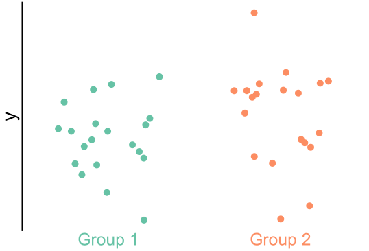
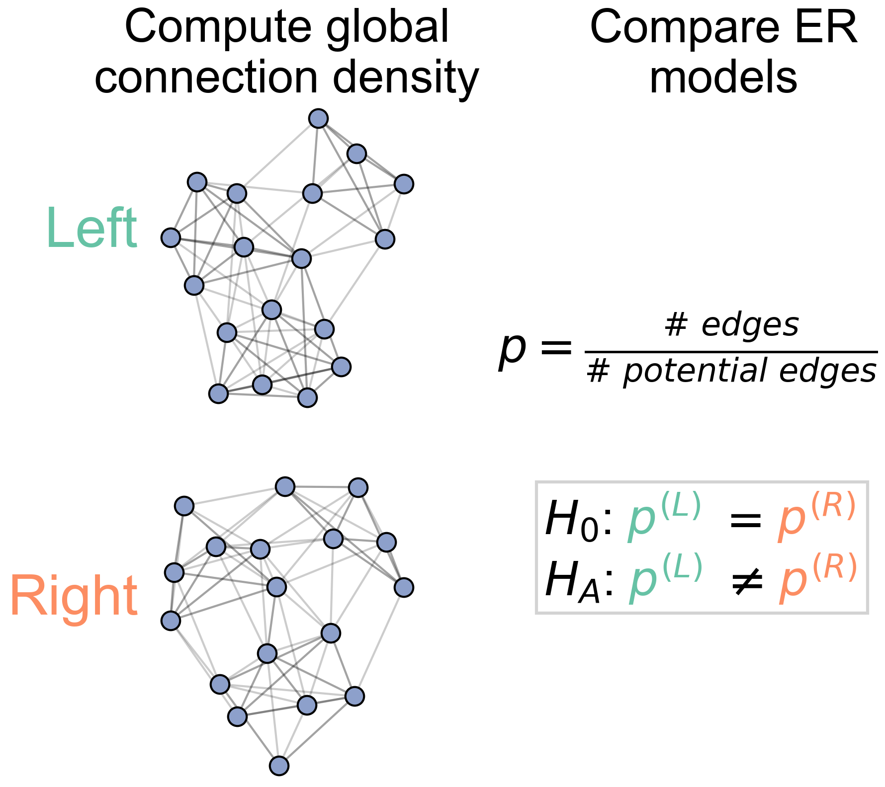
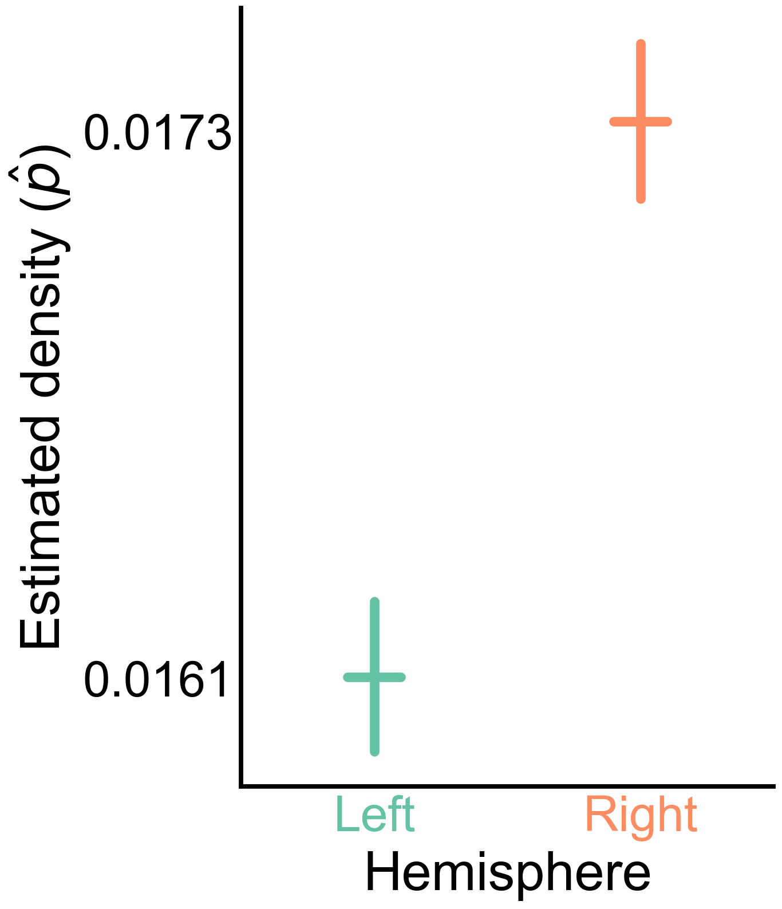
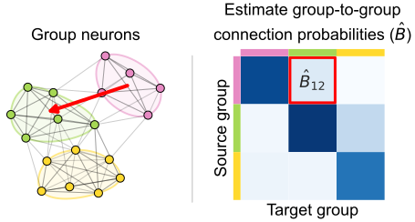
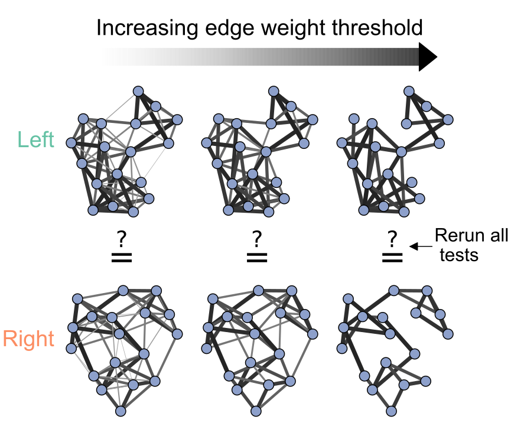

<!-- _paginate: false -->

<!-- # Generative network modeling reveals a first quantitative definition of bilateral symmetry exhibited by a whole insect brain connectome -->
<!--  [_@bpedigod (Twitter)_](https://twitter.com/bpedigod) -->

<!-- # Generative network modeling reveals a quantitative definition of bilateral symmetry exhibited by a whole insect brain connectome -->
# Model-based comparison of connectomes: evaluating the bilateral symmetry of a whole insect brain

## Benjamin D. Pedigo
_(he/him) -  [_bpedigo@jhu.edu_](mailto:bpedigo@jhu.edu) 
[NeuroData lab](https://neurodata.io/)_
_Johns Hopkins University - Biomedical Engineering_

#### Team

<!-- Start people panels -->

Mike Powell

Eric Bridgeford

Michael Winding

Marta Zlatic

Albert Cardona

Carey Priebe

Joshua Vogelstein

<!-- End people panels -->

<!-- 

<!--  -->

<!--  -->

<!-- 
 [_bpedigo@jhu.edu_](mailto:bpedigo@jhu.edu)
 [_@bdpedigo (Github)_](https://github.com/bdpedigo)
 [_@bpedigod (Twitter)_](https://twitter.com/bpedigod)
 [https://bdpedigo.github.io/](https://bdpedigo.github.io/) -->

<!-- <!-- --- -->

<!-- ---
# Motivation
- This is why we need to compare connectomes to understand x,y,z
- Need methods etc. -->

<!-- ---
# What we do (notes)
- clustering
- model estimation
- flow
- testing for differences (e.g. left/right)
- matching (e.g. left/right)
- testing for stereotypy at the edge level (combo of the above two) -->

<!-- --- 
# Approaches for analyzing connectome data

- Model-based clustering of neurons by connectivity 
- Graph matching to estimate correspondence of neurons between datasets/brain hemispheres
- **Statistical testing for connectome comparison**

## Are the  left  and  right  sides of the larva brain connectome 
 
 *different*? -->

--- 
# Why bilateral symmetry?
- Fundamental property of almost all animals
- Often (implicitly or explicitly) assumed in connectomics
- ...but many ways to write down what we mean for the networks

# Why else?
- As more connectomes are mapped, we'll want evaluate the *significance* and *nature* of differences between them

## Are the  left  and  right  sides of the larva brain connectome 
 
 *different*?

<!-- --- 
# Larval _Drosophila_ brain connectome

## Are the  left  and  right  sides of this connectome 
 
 *different*? -->

<!-- <footer>
Winding, Pedigo et al. “The complete connectome of an insect brain.” In prep. (2022)
</footer> -->
<!-- 
---
# Explain the statistical approach
- Decide what you want to quantify or compare -->

<!-- --- -->

<!-- # Are these populations different?

- Known as two-sample testing
- $\color{#66c2a5} Y^{(1)} \sim F^{(1)}$, $\color{#fc8d62} Y^{(2)} \sim F^{(2)}$
- $H_0: \color{#66c2a5} F^{(1)} \color{black} = \color{#fc8d62} F^{(2)}$  
  $H_A: \color{#66c2a5} F^{(1)} \color{black} \neq \color{#fc8d62} F^{(2)}$

 -->

<!-- --- 
# Are these two _networks_ different?

- Want a **two-network-sample** test!
-  $A^{(L)} \sim F^{(L)}$,  $A^{(R)} \sim F^{(R)}$ 
- $H_0: \color{#66c2a5} F^{(L)} \color{black} = \color{#fc8d62}F^{(R)}$  
  $H_A: \color{#66c2a5} F^{(L)} \color{black} \neq  \color{#fc8d62} F^{(R)}$
- What's $F$ for a network?
- We'll start with $A$ (the networks) being directed, unweighted (for now)

 -->

---
# Testing for differences

### Are these two populations different?

&nbsp; &nbsp; $\color{#66c2a5} Y^{(1)} \sim F^{(1)}$ &nbsp; &nbsp; &nbsp;  $\color{#fc8d62} Y^{(2)} \sim F^{(2)}$

$H_0: \color{#66c2a5} F^{(1)} \color{black} = \color{#fc8d62} F^{(2)}$  
$H_A: \color{#66c2a5} F^{(1)} \color{black} \neq \color{#fc8d62} F^{(2)}$

### Are these two *networks* different?

 $A^{(L)} \sim F^{(L)}$ &nbsp; &nbsp; &nbsp; &nbsp;  $A^{(R)} \sim F^{(R)}$ 

$H_0: \color{#66c2a5} F^{(L)} \color{black} = \color{#fc8d62}F^{(R)}$  
$H_A: \color{#66c2a5} F^{(L)} \color{black} \neq  \color{#fc8d62} F^{(R)}$

---
# We reject even the simplest notion of symmetry

- Fit Erdos-Renyi models to the left and the right brain networks

- Compare densities:
  $H_0: \color{#66c2a5} p^{(L)} \color{black} = \color{#fc8d62}p^{(R)}$  
  $H_A: \color{#66c2a5} p^{(L)} \color{black} \neq  \color{#fc8d62} p^{(R)}$

<!--  -->

 

p-value: ${<}10^{-23}$

---
# Localizing differences to cell type connections

- Fit block models to both hemispheres
  
- Compare connection probabilities:
  $H_0: \color{#66c2a5} B^{(L)} \color{black} = \color{#fc8d62} B^{(R)}$ 
  $H_A: \color{#66c2a5} B^{(L)} \color{black} \neq  \color{#fc8d62} B^{(R)}$

Overall comparison: $p < 10^{-7}$

After adjusting for density: $p <0.01$

<!-- # Extensions (current and future)

- How does evaluation of symmetry depend on what you call a "cell type"?
  - Clustering neurons by connectivity
- Evaluating symmetry at the edge-level using neuron pairs
  - Testing for significant alignment with graph matching
- Power analysis: what differences could one even conceivably detect in a comparative connectomics experiment?
- **What about edge weights?** -->

<!-- 

 -->

<!-- ---
# Rescaling connection probabilities focuses remaining asymmetry on Kenyon cells

w/ Kenyon cells: $p < 0.05$
w/o Kenyon cells: $p \approx 0.51$

 -->

---
# Extentions: examining the effect of edge weights

*Only occurs when using input percentage as edge weight, not synapse number*

---
# Extensions: incorporating neuron/connection matching

Neuron pair predictions from connectivity using improved graph matching tools

*Ongoing work*: combining matching and testing frameworks to evaluate stereotypy at the edge-level

<!-- *Ongoing work: testing for a significant matching/symmetry using tools from graph matching* -->

<!-- ---

## graspologic:

[github.com/microsoft/graspologic](https://github.com/microsoft/graspologic)

      

## This work:
[github.com/neurodata/bilateral-connectome](https://github.com/neurodata/bilateral-connectome) 

 -->

<!-- # Conclusions  -->

<!-- ---

## Conclusions

- Testing hypotheses in connectomics requires techniques for networks
    - We presented procedures for comparing connectomes
- Used to evaluate bilateral symmetry, finding how this brain is/is not bilaterally symmetric
- Poised to apply these tools to answer...
   - **{Your question here}**
   - Get in touch: 
     -  [_bpedigo@jhu.edu_](mailto:bpedigo@jhu.edu) 
     -  [_jovo@jhu.edu_](mailto:jovo@jhu.edu)

 -->

<!-- ## More info
-  
- This work: [github.com/neurodata/bilateral-connectome](https://github.com/neurodata/bilateral-connectome)
- Chung et al. *Statistical connectomics* (2021)
- Data: Winding, Pedigo et al. *In preparation* (2022) -->

<!-- --- 

## Conclusions

- We focus on statistical analyses of connectome networks
- We developed tools for testing for differences between connectome networks
- Found ways in which the hemispheres of larval brain could or could not be considered "different" 

## Future work
- Testing for stereotypy/differences *at an *

 -->

---
# An invitation!

- Want to use anything I talked about today?
- OR have another network question you want to test?
- **Let's chat!**

Code, slides, papers, contact info:

 [_bpedigo@jhu.edu_](mailto:bpedigo@jhu.edu)     [_@bpedigod_](https://twitter.com/bpedigod)
 [_@bdpedigo_](https://github.com/bdpedigo) [bdpedigo.github.io](https://bdpedigo.github.io/)

<!-- <footer>Chung, Pedigo et al. JMLR (2019)   Winding, Pedigo et al. In prep. (2022)   Pedigo et al. In prep. (2022)</footer> -->

<!-- ---
# Questions?

 
 
 
 
 

### Benjamin D. Pedigo
 [_bpedigo@jhu.edu_](mailto:bpedigo@jhu.edu)
 [_@bpedigod (Twitter)_](https://twitter.com/bpedigod)
 [_@bdpedigo (Github)_](https://github.com/bdpedigo)
 [https://bdpedigo.github.io/](https://bdpedigo.github.io/) -->

<!-- Ross: better summary of what the actual summary/conclusion is -->
<!-- Never say the method that we're using -->
<!-- Talk about it as a toolbox? -->
<!-- Sell the work a bit more in terms of novelty - nobody else has done x -->
<!-- Toolset vs. symmetry is complicated -->
<!--  -->