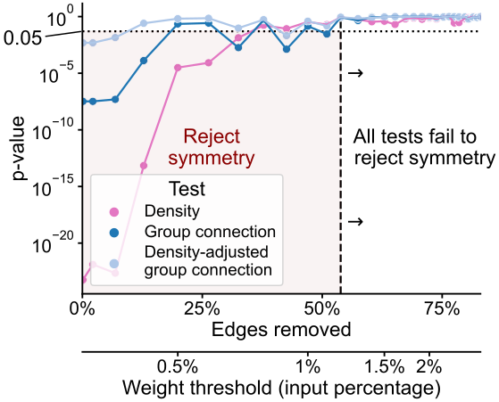

<!-- _paginate: false -->

<!-- # Generative network modeling reveals a first quantitative definition of bilateral symmetry exhibited by a whole insect brain connectome -->
<!--  [_@bpedigod (Twitter)_](https://twitter.com/bpedigod) -->

<!-- # Generative network modeling reveals a first quantitative definition of bilateral symmetry exhibited by a whole insect brain connectome -->
# Model-based comparison of connectomes: applications in a whole insect brain

## Benjamin D. Pedigo
_(he/him) -  [_bpedigo@jhu.edu_](mailto:bpedigo@jhu.edu) 
[NeuroData lab](https://neurodata.io/)_
_Johns Hopkins University - Biomedical Engineering_

#### Team
<!-- Start people panels -->

Mike Powell

Eric Bridgeford

Michael Winding

Marta Zlatic

Albert Cardona

Carey Priebe

Joshua Vogelstein

<!-- End people panels -->

<!-- 

<!--  -->

<!--  -->

<!-- 
 [_bpedigo@jhu.edu_](mailto:bpedigo@jhu.edu)
 [_@bdpedigo (Github)_](https://github.com/bdpedigo)
 [_@bpedigod (Twitter)_](https://twitter.com/bpedigod)
 [https://bdpedigo.github.io/](https://bdpedigo.github.io/) -->

<!-- <!-- --- -->

<!-- ---
# Motivation
- This is why we need to compare connectomes to understand x,y,z
- Need methods etc. -->

<!-- ---
# What we do (notes)
- clustering
- model estimation
- flow
- testing for differences (e.g. left/right)
- matching (e.g. left/right)
- testing for stereotypy at the edge level (combo of the above two) -->

--- 
# Larval _Drosophila_ brain connectome

## Are the  left  and  right  sides of this connectome 
 
 *different*?

<!-- <footer>
Winding, Pedigo et al. “The complete connectome of an insect brain.” In prep. (2022)
</footer> -->

---
# Explain the statistical approach

---
# We reject even the simplest notion of symmetry

- Fit Erdos-Renyi models to the left and the right brain networks

- Compare densities:
  $H_0: \color{#66c2a5} p^{(L)} \color{black} = \color{#fc8d62}p^{(R)}$  
  $H_A: \color{#66c2a5} p^{(L)} \color{black} \neq  \color{#fc8d62} p^{(R)}$

<!--  -->

 

p-value: ${<}10^{-23}$

---
# Localizing differences to cell type connections

- Fit block models to both hemispheres
  
- Compare connection probabilities:
  $H_0: \color{#66c2a5} B^{(L)} \color{black} = \color{#fc8d62} B^{(R)}$ 
  $H_A: \color{#66c2a5} B^{(L)} \color{black} \neq  \color{#fc8d62} B^{(R)}$

p-value: ${<}10^{-7}$

---
# Rescaling connection probabilities focuses remaining asymmetry on Kenyon cells

w/ Kenyon cells: $p < 0.05$
w/o Kenyon cells: $p \approx 0.51$

<!-- 

<!-- p-value: ~$0.51$ -->
<!--  -->

---
# Higher edge weights (as neuron's input percentage) are more symmetric

<!-- *Only occurs when using input percentage as edge weight* -->

<!-- ---

## graspologic:

[github.com/microsoft/graspologic](https://github.com/microsoft/graspologic)

      

## This work:
[github.com/neurodata/bilateral-connectome](https://github.com/neurodata/bilateral-connectome) 

 -->

<!-- # Conclusions  -->

<!-- ---

## Conclusions

- Testing hypotheses in connectomics requires techniques for networks
    - We presented procedures for comparing connectomes
- Used to evaluate bilateral symmetry, finding how this brain is/is not bilaterally symmetric
- Poised to apply these tools to answer...
   - **{Your question here}**
   - Get in touch: 
     -  [_bpedigo@jhu.edu_](mailto:bpedigo@jhu.edu) 
     -  [_jovo@jhu.edu_](mailto:jovo@jhu.edu)

 -->

<!-- ## More info
-  
- This work: [github.com/neurodata/bilateral-connectome](https://github.com/neurodata/bilateral-connectome)
- Chung et al. *Statistical connectomics* (2021)
- Data: Winding, Pedigo et al. *In preparation* (2022) -->

---
# An invitation!

- We focus on statistical analyses of connectome networks
  - Today, I talked about work on comparing two connectomes and applying these tools to the bilateral symmetry of the larva
- Want to use anything I talked about today?
- OR have another network question you want to test?
- **Get in touch!**

Code, slides, papers, contact info:

 [_bpedigo@jhu.edu_](mailto:bpedigo@jhu.edu)     [_@bpedigod_](https://twitter.com/bpedigod)
 [_@bdpedigo_](https://github.com/bdpedigo) [bdpedigo.github.io](https://bdpedigo.github.io/)

<!-- <footer>Chung, Pedigo et al. JMLR (2019)   Winding, Pedigo et al. In prep. (2022)   Pedigo et al. In prep. (2022)</footer> -->

<!-- ---
# Questions?

 
 
 
 
 

### Benjamin D. Pedigo
 [_bpedigo@jhu.edu_](mailto:bpedigo@jhu.edu)
 [_@bpedigod (Twitter)_](https://twitter.com/bpedigod)
 [_@bdpedigo (Github)_](https://github.com/bdpedigo)
 [https://bdpedigo.github.io/](https://bdpedigo.github.io/) -->

