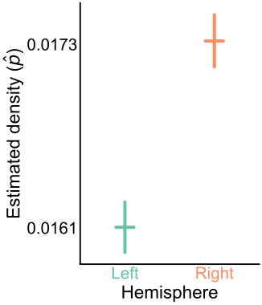
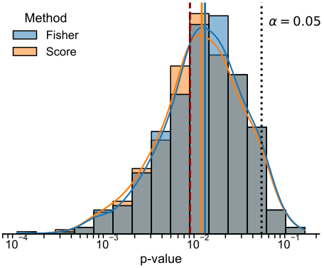
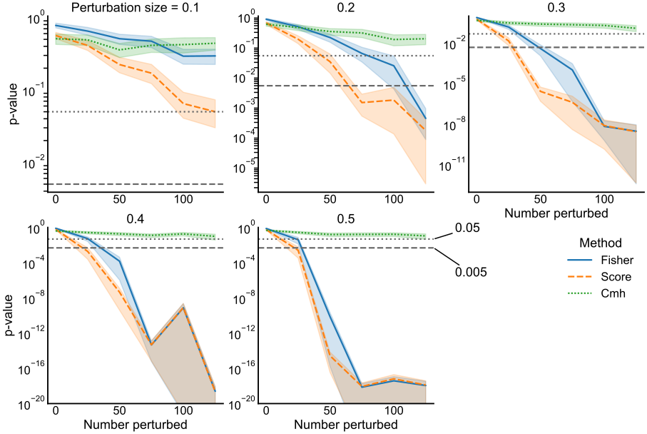
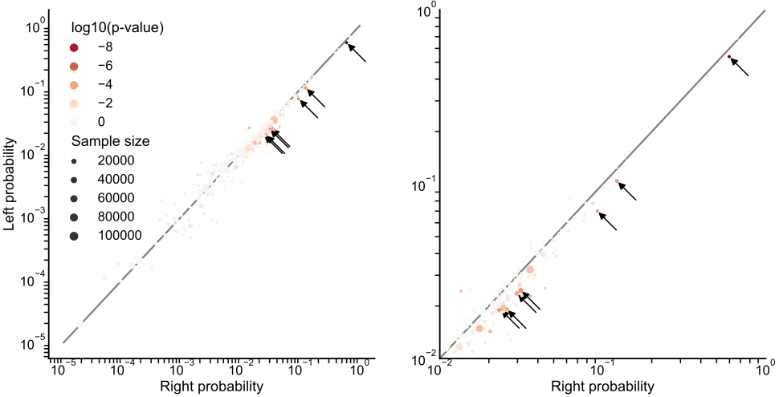

<!-- # Maggot brain, mirror image? A statistical analysis of bilateral symmetry in an insect brain connectome -->

<!-- # A statistical analysis of bilateral symmetry in an insect connectome -->

<!-- # Two-sample hypothesis testing for connectomes: 
## A case study on the bilateral symmetry of the *Drosophila* larva connectome -->

# Hypothesis testing for connectome comparisons: a statistical analysis of bilateral symmetry in an insect brain connectome

### Benjamin D. Pedigo 
(he/him) - _[NeuroData lab](https://neurodata.io/)_
_Johns Hopkins University - Biomedical Engineering_

 [_bpedigo@jhu.edu_](mailto:bpedigo@jhu.edu)
 [_@bdpedigo (Github)_](https://github.com/bdpedigo)
 [_@bpedigod (Twitter)_](https://twitter.com/bpedigod)
 [https://bdpedigo.github.io/](https://bdpedigo.github.io/)

--- 
# Outline
- What is electron microscopy connectomics 
- *Drosophila* larva brain connectome
- Why we should care about comparing connectomes
- Bilateral symmetry
- Extensions and other tools

<!-- What about weights? 
What about the partition?
What about matched pairs? -->
<!-- - Two sample testing
- Density test
- Group connection probability test
- Adjusting for a difference in density
- Removing -->
  
---

# Electron microscopy connectomics

<footer>
Winding, Pedigo et al. “The complete connectome of an insect brain.” In prep. (2022)
</footer>

---

# _Drosophila_ larva (AKA a maggot) brain connectome

<!-- See [Michael Windings's talk](https://conference.neuromatch.io/abstract?edition=2021-4&submission_id=recVeh4RZFFRAQnIo) -->
- Collaboration with Marta Zlatic/Albert Cardona's groups - led by Michael Winding
- First whole-brain, single-cell connectome of any insect
- ~3000 neurons, ~550K synapses
- Both hemispheres of the brain reconstructed

<!--  -->

<footer>
Winding, Pedigo et al. “The complete connectome of an insect brain.” In prep. (2022)
</footer>

---
# We're just going to consider this to be a network

.png)

---
# Why bilateral symmetry?

> "We examined the connectivity of members of left–right homologous neuron pairs ... **to assess the amount of natural variability in connectivity.** ... **Differences between individual worms will be expected to be at least this large.**"

> "... the gustatory neuron ASEL (that is, the left neuron of the pair) has greater chemical connectivity than ASER (that is, the right neuron of the pair) to the olfactory neuron class AWC."

<footer>
Cook et al. Nature (2019)
</footer>

---

# Many connectomics questions require comparison

<!-- For instance,
- Understand connectomes across evolution [1]
- Understand connectomes across development [2]
- Understand links between genetics and connectivity [3] 

<footer>

[1] Bartsotti + Correia et al. *Curr. Op. Neurobiology* (2021)
[2] Witvliet et al. *Nature* (2021)
[3] Valdes-Aleman et al. *Neuron* (2021)

</footer> -->

---
# Connectomes across development

<footer>Witvliet et al. Nature (2021)</footer>

---
# Connectomes across evolution, cortex

<footer>
Bartsotti + Correia et al. Curr. Op. Neurobiology (2021)

</footer>

---
# So, studying bilateral symmetry here lets us
- Try to formalize what we even mean by this property, and make claims about what we find in this connectome, and
- Test out methods for comparing networks for these future pursuits

---

# Are the  left  and  right  sides of this connectome 
 
 *different*?

---

# Are these populations different?

- Known as two-sample testing
- $\color{#66c2a5} Y^{(1)} \sim F^{(1)}$, $\color{#fc8d62} Y^{(2)} \sim F^{(2)}$
- $H_0: \color{#66c2a5} F^{(1)} \color{black} = \color{#fc8d62} F^{(2)}$  
  $H_A: \color{#66c2a5} F^{(1)} \color{black} \neq \color{#fc8d62} F^{(2)}$

--- 
# Are these two _networks_ different?

- Want a two-network-sample test!
-  $A^{(L)} \sim F^{(L)}$,  $A^{(R)} \sim F^{(R)}$ 
- $H_0: \color{#66c2a5} F^{(L)} \color{black} = \color{#fc8d62}F^{(R)}$  
  $H_A: \color{#66c2a5} F^{(L)} \color{black} \neq  \color{#fc8d62} F^{(R)}$

---
# Assumptions
- We know the direction of synapses, so network is *directed*.
- For simplicity (for now), consider networks to be *unweighted*.
- For simplicity (for now), consider the  left $\rightarrow$ left  and  right $\rightarrow$ right  (*ipsilateral*) connections only.
- Not going to assume any nodes are matched

---
# Erdos-Renyi model

- All edges are indepentent
- All edges generated with the same probability, $p$

---
# Density-based testing

<!-- 

 -->

<!-- - $P[i \rightarrow j] = p$ -->
<!-- - Compare probabilities:
  $H_0: \color{#66c2a5} p^{(L)} \color{black} = \color{#fc8d62}p^{(R)}$  
  $H_A: \color{#66c2a5} p^{(L)} \color{black} \neq  \color{#fc8d62} p^{(R)}$ -->

<!-- 

 -->

<!-- 

 -->

---
# We detect a difference in density

- p-value < $10^{-22}$

--- 
# Stochastic block model

- Edge probabilities are a function of a neuron's group

---
# Connection probabilities between groups

<!-- 

 -->

--- 
# Group-based testing

--- 
# We detect a difference in group-to-group connection probabilities

- After multiple comparison, find 5 group-to-group connections which are significantly different
- Combine (uncorrected) p-values (like a meta-analysis), leads to p-value for overall test of $<10^{-7}$

---
# Should we be surprised?

- Already saw that even the overall densities were different
- For all significant comparisons, probabilities on the right hemisphere were higher
- Maybe the right is just a "scaled up" version of the left?
   - $H_0: \color{#66c2a5}B^{(L)} \color{black}  = c \color{#fc8d62}B^{(R)}$  
  where $c$ is a density-adjusting constant, $\frac{\color{#66c2a5} p^{(L)}}{\color{#fc8d62} p^{(R)}}$

---
# Adjusting for a difference in density

---
# Even with density adjustment, we detect a difference

---
# So the Kenyon cells (KCs) are the only group where we detect remaining differences...

- ER test: $p <10^{-26}$
- SBM test: $p \approx 0.003$
- Adjusted SBM test: $p \approx 0.43$

---
# To sum up...

| Model | $H_0$ (vs. $H_A \neq$)                                             |  KCs  |     p-value     | Interpretation                                           |
| ----- | ------------------------------------------------------------------ | :---: | :-------------: | -------------------------------------------------------- |
| ER    | $\color{#66c2a5} p^{(L)} \color{black} = \color{#fc8d62}p^{(R)}$   |   +   |   $<10^{-23}$   | Reject densities the same                                |
| SBM   | $\color{#66c2a5} B^{(L)} \color{black} = \color{#fc8d62} B^{(R)}$  |   +   |   $< 10^{-7}$   | Reject group connection probabilities the same           |
| aSBM  | $\color{#66c2a5}B^{(L)} \color{black}  = c \color{#fc8d62}B^{(R)}$ |   +   | $\approx 0.002$ | Reject above even after accounting for density           |
| ER    | $\color{#66c2a5} p^{(L)} \color{black} = \color{#fc8d62}p^{(R)}$   |   -   |   $<10^{-26}$   | Reject densities the same (w/o KCs)                      |
| SBM   | $\color{#66c2a5} B^{(L)} \color{black} = \color{#fc8d62} B^{(R)}$  |   -   | $\approx 0.003$ | Reject group connection probabilities the same (w/o KCs) |
| aSBM  | $\color{#66c2a5}B^{(L)} \color{black}  = c \color{#fc8d62}B^{(R)}$ |   -   | $\approx 0.43$  | Don't reject above after density adjustment (w/o KCs)    |

---

# Extensions (and other tools)

---

# But you threw out all of the edge weights!

---
# Thresholding at higher synapse counts reduces asymmetry

---

# What do we consider to be a "cell type"?

<!-- ---
# Something about methods for this stuff -->

---
# Hierarchical clustering of neurons based on observed connectivity

<footer> Winding, Pedigo et al. “The complete connectome of an insect brain.” In prep. (2022) </footer>

<!-- TODO something to add some punch here - why care about the clusters -->

---

# Are nodes/edges matched across hemispheres?

---
# Bilateral neuron pairs 

<footer>Eschbach et al. eLife (2021)</footer>

---
# Graph matching

---
# Graph matching predicts single-neuron pairs between hemispheres
- ~86% of predicted pairs are confirmed by a human annotator

<footer> Winding, Pedigo et al. “The complete connectome of an insect brain.” In prep. (2022) </footer>

---
# Predicted pairs are morphologically similar

<footer> Winding, Pedigo et al. “The complete connectome of an insect brain.” In prep. (2022) </footer>

---
# In summary...
- Studied statistical ways of framing "bilateral symmetry", proposing a test procedure for each
- All tests found the left and the right hemispheres significantly different, unless ignoring Kenyon cells and adjust for the difference in density
   <!-- - If there's a statistic (e.g. density) that you *don't* want in your definition of "different," it should be explicitly accounted for  -->
- Provided a foundation for future principled comparisons of connectomes
- Mentioned several other tools/analyses which could alter the definition of symmetry
   - Edge weights
   - Inferring neuron groups
   - Graph matching to find pairs

--- 

## graspologic:

[github.com/microsoft/graspologic](https://github.com/microsoft/graspologic)

      

## This work:
[github.com/neurodata/bilateral-connectome](https://github.com/neurodata/bilateral-connectome) 

<footer>Chung, Pedigo et al. JMLR (2019)</footer>

---
# Acknowledgements

#### Johns Hopkins University
**Mike Powell**, **Eric Bridgeford**, **Carey Priebe**, **Joshua Vogelstein**, Kareef Ullah, Diane Lee, Sambit Panda, Jaewon Chung, Ali Saad-Eldin, NeuroData lab

#### University of Cambridge / MRC Laboratory of Molecular Biology 
**Michael Winding**, Albert Cardona, Marta Zlatic, Chris Barnes

#### Funding

<!-- #### Microsoft Research 
Hayden Helm, Dax Pryce, Nick Caurvina, Bryan Tower, Patrick Bourke, Jonathan McLean, Carolyn Buractaon, Amber Hoak -->

---
# Questions?

 
 
 
 
 

### Benjamin D. Pedigo
 [_bpedigo@jhu.edu_](mailto:bpedigo@jhu.edu)
 [_@bdpedigo (Github)_](https://github.com/bdpedigo)
 [_@bpedigod (Twitter)_](https://twitter.com/bpedigod)
 [https://bdpedigo.github.io/](https://bdpedigo.github.io/)

---

# Appendix 

---
# There are so many other models!

Latent distribution test (random dot product graph)

---

---
# Combining p-values: nobody's perfect

<footer>

Heard, Rubin-Delanchy *Biometrika* (2018)

</footer>

---
# Combining p-values: don't trust SciPy until 1.9.0

---

# Distribution under the null for combining p-values

---

# Combining p-values: be careful with discreetness

 

$\leftarrow$ We are trying to approximate this null distribution with something continuous $Uniform(0,1)$

---
# Power for combining p-values

- We perturb:
  - Some # of them (x-axis)
  - By some amount (panels)

---

# Relative power (Fisher's vs Tippett's)

---
# Plotting connection probabilities 

<!-- ---

 -->