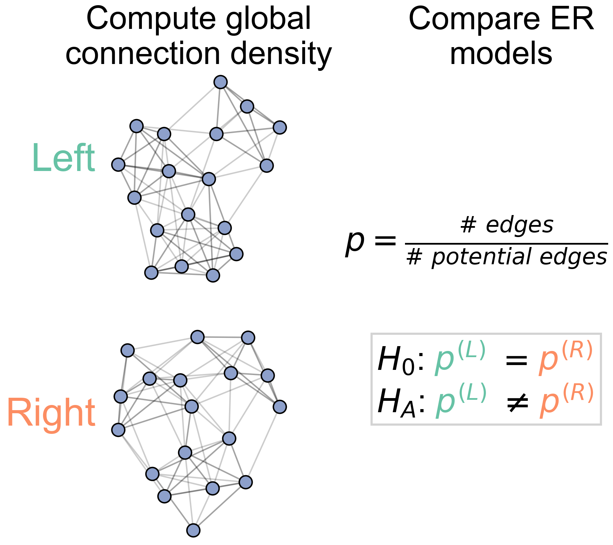
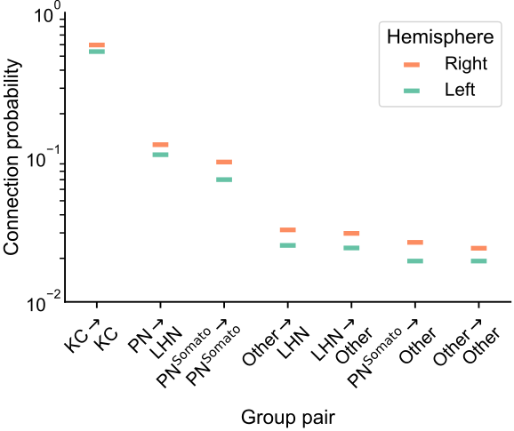
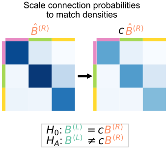

# Maggot brain, mirror image? A statistical analysis of bilateral symmetry in an insect brain connectome

### Benjamin D. Pedigo

_Johns Hopkins University_
_[NeuroData lab](https://neurodata.io/)_
[_@bdpedigo (Github)_](https://github.com/bdpedigo)
[_@bpedigod (Twitter)_](https://twitter.com/bpedigod)
[_bpedigo@jhu.edu_](mailto:bpedigo@jhu.edu)

--- 
# My requests
- Feedback, feedback, feedback
   - Especially with figures 

---
# Electron microscopy connectomics

<footer>
Winding, Pedigo et al. “The complete connectome of an insect brain.” In prep (2021)
</footer>

---

# Larval _Drosophila_ brain connectome

See [Michael Windings's talk](https://conference.neuromatch.io/abstract?edition=2021-4&submission_id=recVeh4RZFFRAQnIo)
- First whole-brain, single-cell connectome of any insect
- ~3000 neurons, ~544K synapses
- Both hemispheres of the brain reconstructed

<!--  -->

<footer>
Winding, Pedigo et al. “The complete connectome of an insect brain.” In prep (2021)
</footer>

---

# Many connectomics questions require comparison

<!-- For instance,
- Understand connectomes across evolution [1]
- Understand connectomes across development [2]
- Understand links between genetics and connectivity [3] 

<footer>

[1] Bartsotti + Correia et al. *Curr. Op. Neurobiology* (2021)
[2] Witvliet et al. *Nature* (2021)
[3] Valdes-Aleman et al. *Neuron* (2021)

</footer> -->

---
# Connectomes across development

<footer>

Witvliet et al. *Nature* (2021)

</footer>

---
# Connectomes across evolution, cortex

<footer>

Bartsotti + Correia et al. *Curr. Op. Neurobiology* (2021)

</footer>

---

# Are the  left  and  right  sides of this connectome 
 
 *the same*?

---

# Are these populations the same?

- Known as two-sample testing
- $\color{#66c2a5} Y^{(1)} \sim F^{(1)}$, $\color{#fc8d62} Y^{(2)} \sim F^{(2)}$
- $H_0: \color{#66c2a5} F^{(1)} \color{black} = \color{#fc8d62} F^{(2)}$  
  $H_A: \color{#66c2a5} F^{(1)} \color{black} \neq \color{#fc8d62} F^{(2)}$

--- 
# Are these two _networks_ the same?

- Want a two-network-sample test!

-  $A^{(L)} \sim F^{(L)}$,  $A^{(R)} \sim F^{(R)}$ 
- $H_0: \color{#66c2a5} F^{(L)} \color{black} = \color{#fc8d62}F^{(R)}$  
  $H_A: \color{#66c2a5} F^{(L)} \color{black} \neq  \color{#fc8d62} F^{(R)}$

---
# Assumptions
- We know the direction of synapses, so network is *directed*.
- For simplicity (for now), consider networks to be *unweighted*.
- For simplicity (for now), consider the  left $\rightarrow$ left  and  right $\rightarrow$ right  (*ipsilateral*) connections only.

---
# Density-based testing: Erdos-Renyi (ER) model

<!-- 

 -->

<!-- - $P[i \rightarrow j] = p$ -->
<!-- - Compare probabilities:
  $H_0: \color{#66c2a5} p^{(L)} \color{black} = \color{#fc8d62}p^{(R)}$  
  $H_A: \color{#66c2a5} p^{(L)} \color{black} \neq  \color{#fc8d62} p^{(R)}$ -->

<!-- 

 -->

<!-- 

 -->

---
# We detect a difference in density

- p-value < $10^{-23}$

--- 
# Group-based testing: stochastic block model (SBM)

---
# Connection probabilities between groups

--- 
# We detect a difference in group-to-group connection probabilities

- After multiple comparison, find 5 group-to-group connections which are significantly different
- Combine (uncorrected) p-values (like a meta-analysis), leads to p-value for overall test of $<10^{-7}$

---
# Should we be surprised?

- Already saw that even the overall densities were different
- For all significant comparisons, probabilities on the right hemisphere were higher
- Maybe the right is just a "scaled up" version of the left?
   - $H_0: \color{#66c2a5}B^{(L)} \color{black}  = c \color{#fc8d62}B^{(R)}$  
  where $c$ is a density-adjusting constant, $\frac{\color{#66c2a5} p^{(L)}}{\color{#fc8d62} p^{(R)}}$

---
# Adjusting for a difference in density

---
# Even with an adjustment, still detect a difference

---
# So the Kenyon cells are the only group with remaining differences...

- ER test: $p <10^{-27}$
- SBM test: $p <...$
- Adjusted SBM test: $p \approx 0.43$

---

# But wait, there's more (tests one could run)!

---
# To sum up...

| Model | $H_0$ (vs. $H_A \neq$)                                             |   KC     | p-value | Interpretation                                     |
| ----- | ------------------------------------------------------------------ | :---: |:-----------: | -------------------------------------------------- |
| ER    | $\color{#66c2a5} p^{(L)} \color{black} = \color{#fc8d62}p^{(R)}$   | + |  $<10^{-23}$  | Reject densities the same                          |
| SBM   | $\color{#66c2a5} B^{(L)} \color{black} = \color{#fc8d62} B^{(R)}$  | + | $< 10^{-7}$  | Reject group connection probabilities the same |
| aSBM   | $\color{#66c2a5}B^{(L)} \color{black}  = c \color{#fc8d62}B^{(R)}$ | + | $\approx 0.0016$ | Reject above even after accounting for density  |
| ER    | $\color{#66c2a5} p^{(L)} \color{black} = \color{#fc8d62}p^{(R)}$   | - |  $<10^{-27}$  | Reject densities the same (w/o KCs)                        |
| SBM   | $\color{#66c2a5} B^{(L)} \color{black} = \color{#fc8d62} B^{(R)}$  | - | $< 10^{-4}$  | Reject group connection probabilities the same (w/o KCs) |
| aSBM   | $\color{#66c2a5}B^{(L)} \color{black}  = c \color{#fc8d62}B^{(R)}$ | - | $\approx 0.43$ | Don't reject after density adjustment (w/o KCs)  |

---
# More generally 
- We studied simple ways of framing a network two sample test
- We found that it can be important to "mod out" by other simple network statistics if you don't care about them (like density)
- We provide recommendations for what to run for you future connectome comparisons

--- 

## graspologic:

[github.com/microsoft/graspologic](https://github.com/microsoft/graspologic)

      

## This work:
[github.com/neurodata/bilateral-connectome](https://github.com/neurodata/bilateral-connectome) 

<footer>Chung, Pedigo et al. JMLR (2019)</footer>

---
# Acknowledgements

#### Johns Hopkins University
Mike Powell, Eric Bridgeford, Carey Priebe, Joshua Vogelstein, Kareef Ullah, Diane Lee, Sambit Panda, Jaewon Chung, Ali Saad-Eldin, NeuroData lab

#### University of Cambridge / MRC Laboratory of Molecular Biology 
Michael Winding, Albert Cardona, Marta Zlatic, Chris Barnes

#### Microsoft Research 
Hayden Helm, Dax Pryce, Nick Caurvina, Bryan Tower, Patrick Bourke, Jonathan McLean, Carolyn Buractaon, Amber Hoak

---
# Questions?

---

