<!-- _paginate: false -->

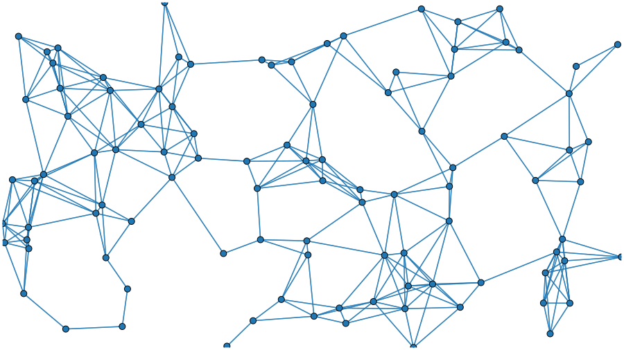

# Investigating the connectome of a larval *Drosophila* brain

 

## Benjamin D. Pedigo
(he/him)
[NeuroData lab](https://neurodata.io/)
Johns Hopkins University - Biomedical Engineering

 [bpedigo@jhu.edu](mailto:bpedigo@jhu.edu)
 [@bdpedigo (Github)](https://github.com/bdpedigo)
 [@bpedigod (Twitter)](https://twitter.com/bpedigod)
 [bdpedigo.github.io](https://bdpedigo.github.io/)

### These slides at: 

<!-- ### [tinyurl.com/princeton-bilarva](https://tinyurl.com/princeton-bilarva) -->

<!-- ---

# Connectomics is useful...

TODO: (5) plot of "connectome prevalence over time"

TODO: (5) highlight one example fly result (? maybe central complex) -->

---

# Many goals of connectomics involve linking the connectome to other properties

---

# Larval *Drosophila* allows access to many properties, e.g.,

## Genetics

## Activity

## Behavior

Eschbach et al. Nat. Neuro (2020)

Eschbach & Zlatic Curr. Op. Neurobio. (2020)

Klein et al. bioRxiv (2021)

Almeida-Carvalho et al. J. Experimental Bio. (2017)

---

# Mapping a larval _Drosophila_ brain connectome 

<!-- _footer: Winding, Pedigo et al. bioRxiv (2022), Ohyama et al. Nature (2015)-->

---
<!-- Timing: ~6 min -->

# Larval _Drosophila_ brain connectome 

 

~3k neurons, ~550K synaptic sites
Both hemispheres

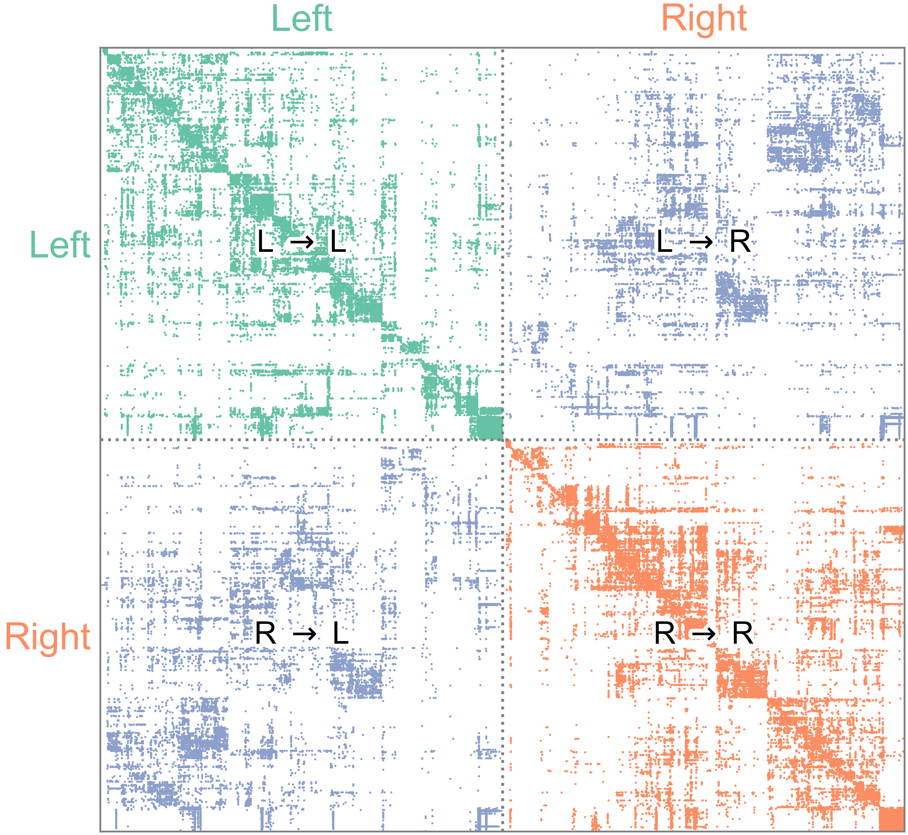

<!-- _footer: Winding, Pedigo et al. bioRxiv (2022) -->

<!-- ---
# What do we do with these datasets once we have them?

- Characterizing network structure, e.g.,
  - How could signals travel on this network, from sensory inputs to motor outputs?
  - What cells have similar patterns of connectivity?
- Hypothesis testing
  - Connectome (network) as an object that we want to "do inference" on  -->

<!-- --- 
# Connectome $\leftrightarrow$ {development, genetics}

> ... we selectively altered the location or activity of [...] neurons and generated new EM volumes of the manipulated samples **to investigate the effects on connectivity**.

*Emphasis added* -->

--- 

# Outline

- ### **Larval connectome dataset**
  - Flow and edge types
  - Connectivity-based cell types
- ### Connectome comparison via network hypothesis testing
- ### Pairing neurons across connectomes via graph matching
- ### Ongoing extensions/applications

---

# High level (mostly anatomical) cell types

<!-- _footer: Winding, Pedigo et al. bioRxiv (2022) -->

---

# Sorting the network

<!-- _footer: Carmel et al. IEEE Vis. and Comp. Graphics (2004), Burkard et al. Assignment Problems (2009)  -->

---
# Quantifying high-level "feedforward/feedback"

<!--  -->

 

<!-- _footer: Winding, Pedigo et al. bioRxiv (2022) -->

--- 

# Morphology enables splitting axons/dendrites 

<!--  -->

<!-- _footer: Winding, Pedigo et al. bioRxiv (2022) -->

<!-- ---

# This split induces 4 graphs (or layers)

 -->

<!-- _footer: Winding, Pedigo et al. bioRxiv (2022) -->

<!-- # What are these different "channels" doing?

 -->

<!-- _footer: Winding, Pedigo et al. bioRxiv (2022) -->

<!--
---

# Sorting the network

-->

<!-- ---

# Comparing independently sorted "channels"

 -->

<!-- _footer: Winding, Pedigo et al. bioRxiv (2022) -->

<!-- --- 
# Edge reciprocity

_footer: Winding, Pedigo et al. bioRxiv (2022) -->

--- 

# Outline

- ### **Larval connectome dataset**
  - Flow and edge types
  - Connectivity-based cell types
- ### Connectome comparison via network hypothesis testing
- ### Pairing neurons across connectomes via graph matching
- ### Ongoing extensions/applications

---

# Stochastic block model

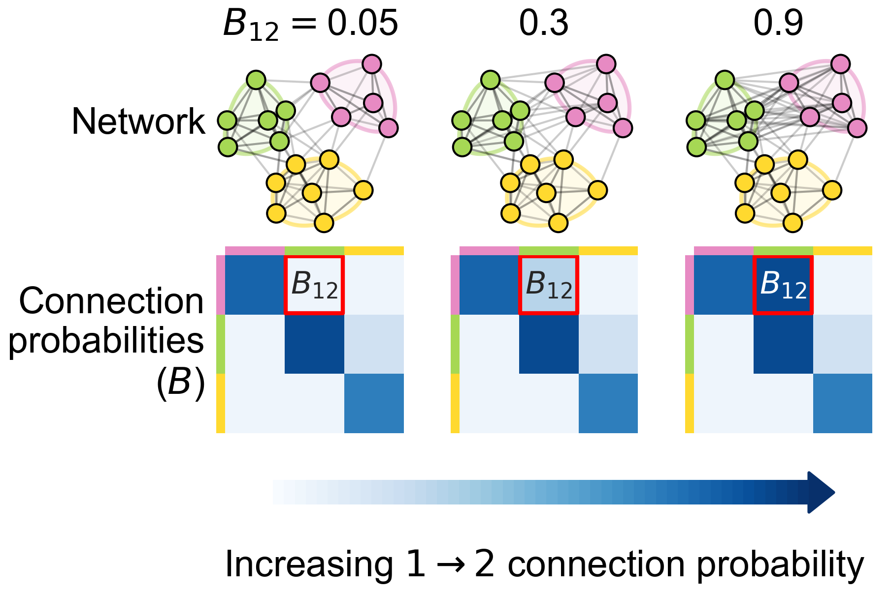

- Each node is assigned to a group
- $B$ is a matrix of connection probabilities between groups
- Edges generated independently according to these probabilities

---
# Spectral embedding

- Spectral decomposition of the adjacency matrix (or Laplacian)
- Clustering on this representation is a consistent estimator of block model labels

<!-- _footer: Sussman et al. JASA (2012), Chung et al. Annual Review of Statistics (2021) -->

<!-- ---
# Spectral clustering proceedure
- mention embedding
- cluster - when to stop

_footer: Winding, Pedigo et al. bioRxiv (2022) -->

---

# Neurons clustered by connectivity using recursive spectral clustering

<!-- Where to stop splitting? -->

<!-- _footer: Winding, Pedigo et al. bioRxiv (2022) -->

--- 

<!-- ### Cluster morphology  -->

--- 

# Cluster morphology 

## Discriminability:
$P[$ within cluster NBLAST sim. $>$ between cluster NBLAST sim. $] \approx 0.81$ 

<!-- _footer: Costa et al. Neuron (2016), Bridgeford et al. PLOS Comp. Bio. (2021)-->

---
# Using models to evaluate cell type groupings
<!-- TODO: (2) diagram/describe SBM cross validation -->

<!--  -->

<!-- - Clustering nodes corresponds with inferring groups in a stochastic block model (DCSBM) -->
- How well do these models generalize to the other side of the brain (let alone the next maggot)?

---

# Bilateral symmetry

> "This brain is bilaterally symmetric."
<!-- > &nbsp;&nbsp;&nbsp;&nbsp;&nbsp;&nbsp;  -Neuroscientists -->

> "What does that even mean? And how would we know if it wasn't?"
<!-- > &nbsp;&nbsp;&nbsp;&nbsp;&nbsp;&nbsp;  -Us -->

<!--  -->
<!--  -->

## Are the  left  and  right  sides of this connectome 
 
 *different*?

--- 

# Outline

- ### Larval connectome dataset
- ### **Connectome comparison via network hypothesis testing**
- ### Pairing neurons across connectomes via graph matching
- ### Ongoing extensions/applications

---

# Are these populations different?

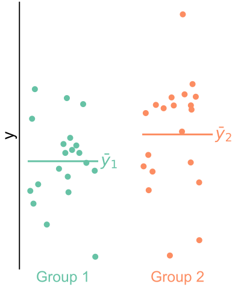

- Known as two-sample testing
- $\color{#66c2a5} Y^{(1)} \sim F^{(1)}$, $\color{#fc8d62} Y^{(2)} \sim F^{(2)}$
- $H_0: \color{#66c2a5} F^{(1)} \color{black} = \color{#fc8d62} F^{(2)}$  
  $H_A: \color{#66c2a5} F^{(1)} \color{black} \neq \color{#fc8d62} F^{(2)}$

--- 
# Are these _networks_ different?

- Want a two-network-sample test!
-  $A^{(L)} \sim F^{(L)}$,  $A^{(R)} \sim F^{(R)}$ 
- $H_0: \color{#66c2a5} F^{(L)} \color{black} = \color{#fc8d62}F^{(R)}$  
  $H_A: \color{#66c2a5} F^{(L)} \color{black} \neq  \color{#fc8d62} F^{(R)}$

<!-- _footer: Pedigo et al. bioRxiv (2022) -->

---
# Assumptions
- Know the direction of synapses, so network is *directed*
- For simplicity (for now), consider networks to be *unweighted*
- For simplicity (for now), consider the  left $\rightarrow$ left  and  right $\rightarrow$ right  (*ipsilateral*) connections
- Not going to assume any nodes are matched

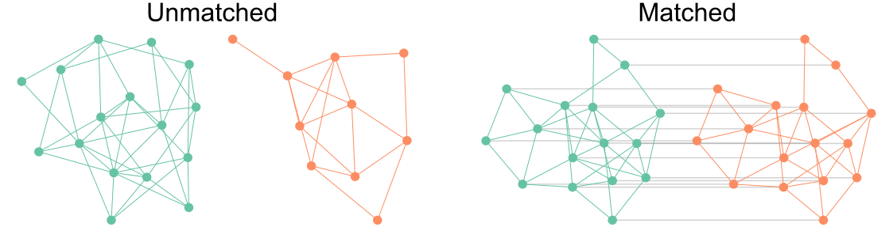

---
# Erdos-Renyi model
<!-- Timing: ~10 -->

- All edges are independent
- All edges generated with the same probability, $p$

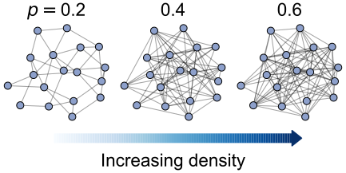

---
# Detect a difference in density

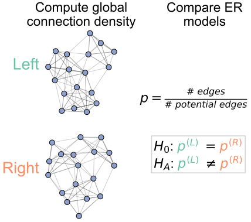

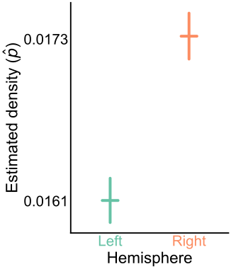

p-value < $10^{-22}$

<!-- _footer: Pedigo et al. bioRxiv (2022) -->

---
# Connection probabilities between groups

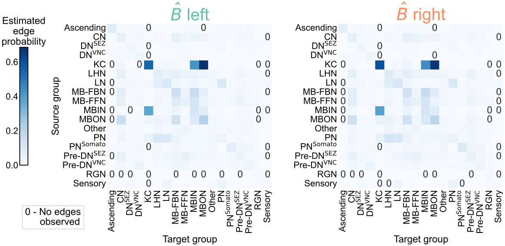

<!-- _footer: Winding, Pedigo et al. bioRxiv (2022), Pedigo et al. bioRxiv (2022) -->

--- 
# Group connection test

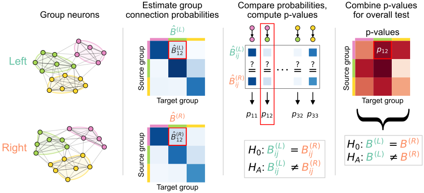

<!-- _footer: Pedigo et al. bioRxiv (2022) -->

--- 
# Detect differences in group connection probabilities

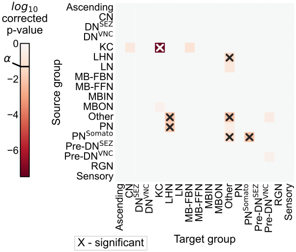

- 6 group-to-group connections are significantly different (after multiple comparisons correction)
- Overall test (comparing all blocks):  p-value $<10^{-7}$

<!-- _footer: Pedigo et al. bioRxiv (2022) -->

---
# Should we be surprised?

- Already saw that even the overall densities were different
- For all significant comparisons, probabilities on the right hemisphere were higher
- Maybe the right is just a "scaled up" version of the left?
   - $H_0: \color{#66c2a5}B^{(L)} \color{black}  = c \color{#fc8d62}B^{(R)}$  
  where $c$ is a density-adjusting constant, $\frac{\color{#66c2a5} p^{(L)}}{\color{#fc8d62} p^{(R)}}$

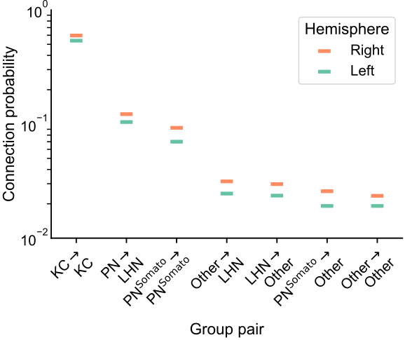

<!-- _footer: Pedigo et al. bioRxiv (2022) -->

---
# After adjusting for density, differences are in KCs

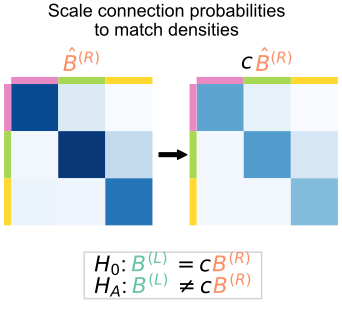

Overall p-value: $<10^{-2}$

<!-- _footer: Pedigo et al. bioRxiv (2022) -->

---
# To sum up...

> "This brain is bilaterally symmetric."
<!-- >   &nbsp;&nbsp;&nbsp;&nbsp;&nbsp;&nbsp;  -Neuroscientists -->

Depends on what you mean...

#### With Kenyon cells
|   Model   |                       $H_0$ (vs. $H_A \neq$)                       |    p-value    |
| :-------: | :----------------------------------------------------------------: | :-----------: |
|  **ER**   |  $\color{#66c2a5} p^{(L)} \color{black} = \color{#fc8d62}p^{(R)}$  | ${<}10^{-23}$ |
|  **SBM**  | $\color{#66c2a5} B^{(L)} \color{black} = \color{#fc8d62} B^{(R)}$  | ${<}10^{-7}$  |
| **daSBM** | $\color{#66c2a5}B^{(L)} \color{black}  = c \color{#fc8d62}B^{(R)}$ | ${<}10^{-2}$  |

#### Without Kenyon cells
|   Model   |                       $H_0$ (vs. $H_A \neq$)                       |    p-value     |
| :-------: | :----------------------------------------------------------------: | :------------: |
|  **ER**   |  $\color{#66c2a5} p^{(L)} \color{black} = \color{#fc8d62}p^{(R)}$  | ${<}10^{-26}$  |
|  **SBM**  | $\color{#66c2a5} B^{(L)} \color{black} = \color{#fc8d62} B^{(R)}$  |  ${<}10^{-2}$  |
| **daSBM** | $\color{#66c2a5}B^{(L)} \color{black}  = c \color{#fc8d62}B^{(R)}$ | $\approx 0.51$ |

<!-- _footer: Pedigo et al. bioRxiv (2022) -->

---
# Examining the effect of edge weights

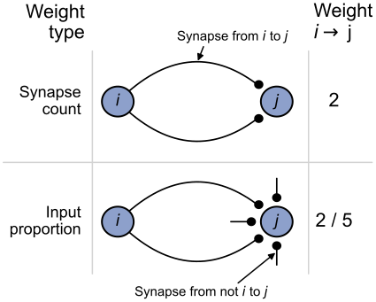

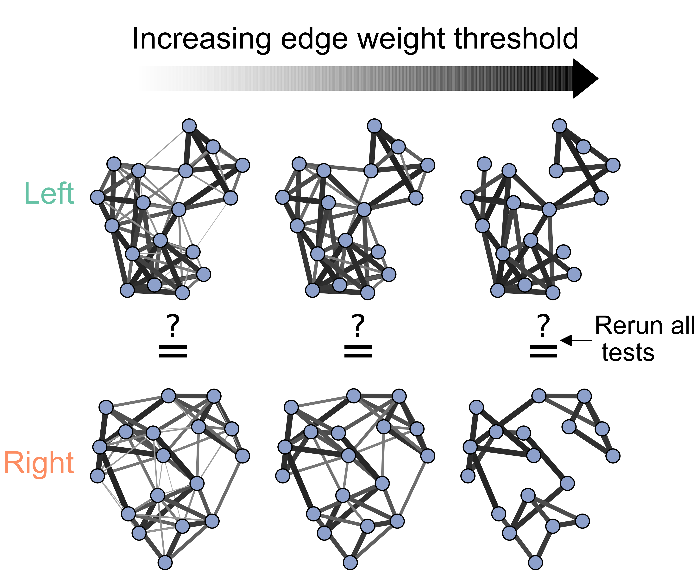

<!-- _footer: Pedigo et al. bioRxiv (2022) -->

---

# Even high synapse count networks show asymmetry

 
 
 

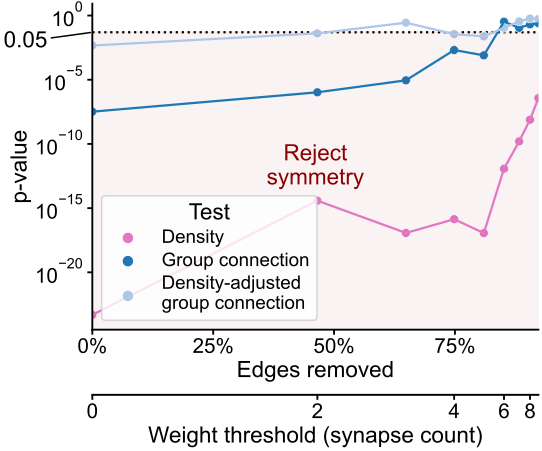

<!-- _footer: Pedigo et al. bioRxiv (2022) -->

---

# High input percentage networks show no asymmetry

<!-- 

## Synapse count thresholding  -->

<!--  -->

<!-- 

## Input proportion thresholding -->
<!-- 

 -->

 
 
 

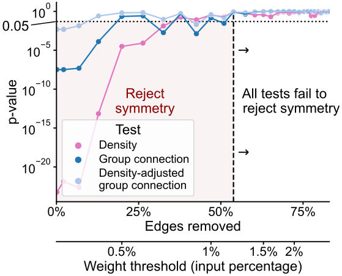

<!-- _footer: Pedigo et al. bioRxiv (2022) -->

--- 

# Outline

- ### Larval connectome dataset
- ### Connectome comparison via network hypothesis testing
- ### **Pairing neurons across connectomes via graph matching**
- ### Ongoing extensions/applications
---

<!-- Timing: 23:00  -->

# Bilaterally homologous neuron pairs 

We believe a matching exists!

<!-- _footer: Eschbach et al. eLife (2021) -->

--- 
# What is graph matching?

---
# How do we measure network overlap?

## $\min_{P \in \mathcal{P}} \underbrace{\|A_1 - \overbrace{PA_2P^T}^{\text{reordered } A_2}\|_F^2}_{\text{distance between adj. mats.}}$

where $\mathcal{P}$ is the set of permutation matrices

<!-- TODO: (3) make a figure diagraming a permutation/matching of nodes -->

- Measures the number of edge disagreements for unweighted networks,
- Norm of edge disagreements for weighted networks

---
# How do we do graph matching?

- Relax the problem to a continuos space
  - Convex hull of permutation matrices
- Minimize a linear approximation of objective function (repeat)
- Project back to the closest permutation matrix

<!-- _footer: Vogelstein et al. PLOS One (2015) -->

---
# Matching (by connectivity only) performs fairly well

With "vanilla" graph matching: ~80% correct (according to expert annotator)

---
# Many ways to try to improve on this...

- Edge types allow for "multilayer" graph matching
- Partial knowledge of the matching (seeds)
- Morphology (e.g. NBLAST)

<!--  -->

# Thus far, we've not used the contralateral connections

## These are about 1/3 of the edges in the brain!

<!-- _footer: Pantazis et al. Applied Network Science (2022), Fishkind et al. Pattern Recognition (2019) -->

---
# From graph matching to bisected graph matching

<!-- _footer: Pedigo et al. bioRxiv (2022) -->

--- 
# Contralateral connections are helpful!

<!-- _footer: Pedigo et al. bioRxiv (2022) -->

---
<!-- Timing: 31:00 -->

# Performance improvement on the full brain

--- 

# Outline

- ### Larval connectome dataset
- ### Connectome comparison via network hypothesis testing
- ### Pairing neurons across connectomes via graph matching
- ### **Ongoing extensions/applications**

<!-- ---
# Testing for "stereotypy" in edge structure

Is matching stronger than expected under some model of independent networks?

_footer: Eichler et al. Nature (2017), Fishkind et al. Applied Network Science (2021) -->
---

# Comparative connectomics

- Map connectomes from related individuals/organisms which may differ in feature $X$
- Compare connectomes
- Understand how $X$ {affects, is affected by, is associated with} connectome structure

---

> Comparative connectomics across experience, sex and species is a key next step.

> With comparative connectomics, the search for neural circuit architectures common across species or independently converged into an optimal layout is now possible.

---

# Why is comparative connectomics hard?

- Collecting the data is still a large effort...

- But how do we even compare connectomes once we have them?

## How do we know whether a proposed experiment could even *hope* to answer our questions? How **powerful** is comparative connectomics?

<!-- - ~~Data are networks~~
  - Data are networks with rich attributes
- Data will always have noise
  - "Experimental noise"
  - "Biological noise"
- Data are big (and getting bigger) -->
 

---

# A hypothetical difference we want to detect...

- Start from some subgraph in the connectome, $A$
- Perturb a copy of it, $B$ (add edges)
- Test for differences between $A$ and $B$

---
# Pairs facilitate more powerful tests

<!-- ---
# Ensuring robustness to different alternatives

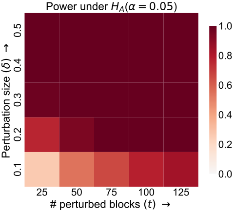 -->

--- 

# Summary 
<!-- 41 min -->

- Characterized "feedforwardness" of this connectome
- Estimated cell types by connectivity

- Model-based network comparison enables testing (and refining) hypotheses about connectomes

- Graph matching can pair neurons across datasets

**Aim to apply these (and other) tools to:**
  **- Inform the design of future comparative experiments,**
  **- Make inferences from connectome comparisons!**

---

## References

<!-- 

 -->

<!-- ## Larva brain connectome -->

[Winding, M. & Pedigo, B.D. et al. The connectome of an insect brain. bioRxiv 2022.11.28.516756 (2022).](https://www.biorxiv.org/content/10.1101/2022.11.28.516756)

[Pedigo, B. D. et al. Generative network modeling reveals quantitative definitions of bilateral symmetry exhibited by a whole insect brain connectome. bioRxiv 2022.11.28.518219 (2022).](https://www.biorxiv.org/content/10.1101/2022.11.28.518219)

[Pedigo, B. D. et al. Bisected graph matching improves automated pairing of bilaterally homologous neurons from connectomes. Network Neuroscience (2022).](https://direct.mit.edu/netn/article/doi/10.1162/netn_a_00287/113527/Bisected-graph-matching-improves-automated-pairing)

## Code

  

[github.com/microsoft/graspologic](https://github.com/microsoft/graspologic)

[github.com/neurodata/maggot_models](github.com/neurodata/maggot_models)

[github.com/neurodata/bilateral-connectome](github.com/neurodata/bilateral-connectome)

[github.com/neurodata/bgm](github.com/neurodata/bgm)

<!-- 

 -->

<!-- ## Model-based testing

 -->

<!-- ## Improved matching

(Or for WIP final implementation see
[github.com/microsoft/graspologic/pull/960](github.com/microsoft/graspologic/pull/960)) -->

<!-- ## graspologic -->
<!-- 

 -->

--- 

# Acknowledgements

#### Team

Michael Winding

Mike Powell

Eric Bridgeford

Ali   Saad-Eldin

Marta Zlatic

Albert Cardona

Carey Priebe

Joshua Vogelstein

Tracers who contributed to larva connectome, Heather Patsolic, Youngser Park, NeuroData lab, Microsoft Research
Figures from Scidraw + Noun Project (Alexander Bates, Xuan Ma, Gil Costa, Vivek Kumar, Leslie Coonrod)

#### Funding
NSF Graduate Research Fellowship (B.D.P.), NSF CAREER Award (J.T.V.), NSF NeuroNex Award (J.T.V and C.E.P.), NIH BRAIN Initiative (J.T.V.)

---
# Questions?

#### Slides: 

<!--   -->
<!--   -->
<!--   -->
<!--   -->
<!-- 
 -->

### Benjamin D. Pedigo
 [bpedigo@jhu.edu](mailto:bpedigo@jhu.edu)
 [@bdpedigo](https://github.com/bdpedigo)
 [@bpedigod](https://twitter.com/bpedigod)
 [bdpedigo.github.io](https://bdpedigo.github.io/)
