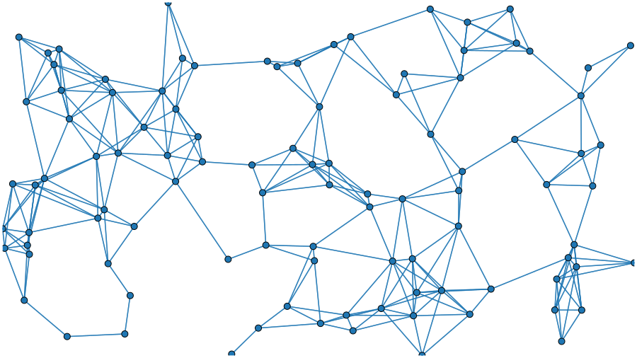
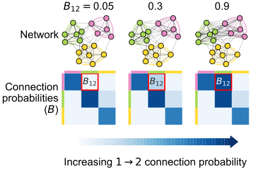

<!-- _paginate: false -->

# Tools for comparative connectomics:   case studies from two sides of a larval Drosophila brain

 

## Benjamin D. Pedigo
(he/him)
[NeuroData lab](https://neurodata.io/)
Johns Hopkins University - Biomedical Engineering

 [bpedigo@jhu.edu](mailto:bpedigo@jhu.edu)
 [@bdpedigo (Github)](https://github.com/bdpedigo)
 [@bpedigod (Twitter)](https://twitter.com/bpedigod)
 [bdpedigo.github.io](https://bdpedigo.github.io/)

### These slides at: 
### [tinyurl.com/princeton-bilarva](https://tinyurl.com/princeton-bilarva)

<!-- ---

# Connectomics is useful...

TODO: (5) plot of "connectome prevalence over time"

TODO: (5) highlight one example fly result (? maybe central complex) -->

---

# Many stated goals of connectomics are to link connectome to other properties

<!-- TODO: (4) finish this figure draw arrows -->

---

# Connectome $\leftrightarrow$ memory

> ...the acquisition of wiring diagrams across multiple individuals will yield insights into **how experiences shape neural connections.**

*Emphasis added*

<!-- TODO: (2) diagram of linking connectome and memory -->

<!-- _footer: Abbott et al. Cell (2020) -->

---
# Connectome $\leftrightarrow$ evolution

> Comparative connectomics of [...] **species across the phylogenetic tree** can infer the archetypal neural architecture of each bauplan and identify any circuits that possibly converged onto a shared and potentially optimal, structure.

*Emphasis added*

<!-- TODO: (2) diagram of comparing connectomes across species -->

<!-- _footer: Barsotti + Correia et al. Curr. Opi. Neurobio. (2021)-->

---
# Connectome $\leftrightarrow$ development

<!-- _footer: Witvliet et al. Nature (2021) -->

---

# Why is comparative connectomics hard?

## Collecting the data is still a large effort...

## But how do we even compare connectomes?
- ~~Data are networks~~
  - Data are networks with rich attributes
- Data are noisy
  - "Experimental noise"
  - "Developmental noise" 
- Data are big (and getting bigger)
 
--- 

# Outline

- ### **Larval connectome dataset**
- ### Connectome comparison via network hypothesis testing
- ### Pairing neurons across connectomes via graph matching
- ### Ongoing extensions/applications

---
<!-- Timing: ~6 min -->

# Larval _Drosophila_ brain connectome 

~3k neurons, ~550K synapses
**Both hemispheres**

<!-- TODO(2) make this a adjacency matrix -->

<!-- _footer: Winding, Pedigo et al. Submitted (2022) -->

---

<!--  -->

# Are the  left  and  right  sides of this connectome 
 
 *different*?

--- 

# Outline

- ### Larval connectome dataset
- ### **Connectome comparison via network hypothesis testing**
- ### Pairing neurons across connectomes via graph matching
- ### Ongoing extensions/applications

---

# Are these populations different?

- Known as two-sample testing
- $\color{#66c2a5} Y^{(1)} \sim F^{(1)}$, $\color{#fc8d62} Y^{(2)} \sim F^{(2)}$
- $H_0: \color{#66c2a5} F^{(1)} \color{black} = \color{#fc8d62} F^{(2)}$  
  $H_A: \color{#66c2a5} F^{(1)} \color{black} \neq \color{#fc8d62} F^{(2)}$

--- 
# Are these _networks_ different?

- Want a two-network-sample test!
-  $A^{(L)} \sim F^{(L)}$,  $A^{(R)} \sim F^{(R)}$ 
- $H_0: \color{#66c2a5} F^{(L)} \color{black} = \color{#fc8d62}F^{(R)}$  
  $H_A: \color{#66c2a5} F^{(L)} \color{black} \neq  \color{#fc8d62} F^{(R)}$

---
# Assumptions
- We know the direction of synapses, so network is *directed*.
- For simplicity (for now), consider networks to be *unweighted*.
- For simplicity (for now), consider the  left $\rightarrow$ left  and  right $\rightarrow$ right  (*ipsilateral*) connections only.
- Not going to assume any nodes are matched

---
# Erdos-Renyi model
<!-- Timing: ~10 -->

- All edges are independent
- All edges generated with the same probability, $p$

---
# We detect a difference in density

p-value < $10^{-22}$

--- 
# Stochastic block model

Edge probabilities are a function of a neuron's group

---
# Connection probabilities between groups

--- 
# Group-based testing

--- 
# Detect a difference in group connection probabilities

- After multiple comparison, find 5 group-to-group connections which are significantly different
- Combine (uncorrected) p-values (like a meta-analysis), leads to p-value for overall test of $<10^{-7}$

---
# Should we be surprised?

- Already saw that even the overall densities were different
- For all significant comparisons, probabilities on the right hemisphere were higher
- Maybe the right is just a "scaled up" version of the left?
   - $H_0: \color{#66c2a5}B^{(L)} \color{black}  = c \color{#fc8d62}B^{(R)}$  
  where $c$ is a density-adjusting constant, $\frac{\color{#66c2a5} p^{(L)}}{\color{#fc8d62} p^{(R)}}$

---
# After adjusting for density, differences are in KCs

<!-- TODO: check this number is right -->

Overall p-value: $<10^{-3}$

---
# When we remove KCs...

- Density test: 
  $p <10^{-26}$
- Group connection test:
  $p \approx 0.003$
- **Density-adjusted group connection test: 
  $p \approx 0.43$**

---
# To sum up...

> "The brain is bilaterally symmetric"
> people

Depends on what you mean...

#### With Kenyon cells
| Model |                       $H_0$ (vs. $H_A \neq$)                       |    p-value    |
| :---: | :----------------------------------------------------------------: | :-----------: |
| **ER** |  $\color{#66c2a5} p^{(L)} \color{black} = \color{#fc8d62}p^{(R)}$  | ${<}10^{-23}$ |
| **SBM** | $\color{#66c2a5} B^{(L)} \color{black} = \color{#fc8d62} B^{(R)}$  | ${<}10^{-7}$  |
| **daSBM** | $\color{#66c2a5}B^{(L)} \color{black}  = c \color{#fc8d62}B^{(R)}$ | ${<}10^{-2}$  |

#### Without Kenyon cells
| Model |                       $H_0$ (vs. $H_A \neq$)                       |    p-value    |
| :---: | :----------------------------------------------------------------: | :-----------: |
| **ER** |  $\color{#66c2a5} p^{(L)} \color{black} = \color{#fc8d62}p^{(R)}$  | ${<}10^{-26}$ |
| **SBM** | $\color{#66c2a5} B^{(L)} \color{black} = \color{#fc8d62} B^{(R)}$  | ${<}10^{-2}$  |
| **daSBM** | $\color{#66c2a5}B^{(L)} \color{black}  = c \color{#fc8d62}B^{(R)}$ |  $\approx 0.51$     |

---
# Examining the effect of edge weights

--- 

# Outline

- ### Larval connectome dataset
- ### Connectome comparison via network hypothesis testing
- ### **Pairing neurons across connectomes via graph matching**
- ### Ongoing extensions/applications
---

<!-- Timing: 23:00  -->

# Bilaterally homologous neuron pairs 

<!-- _footer: Eschbach et al. eLife (2021) -->

---

# Can we use networks structure to predict this pairing?

- Week 1: observe a network of cell phone #s and the calls they make to each other
- Week 2: all of the #s change! But a (noisy) version of that network still exists, with different labels...
- How to map network from week 1 ($A$) to network from week 2 ($B$)?

<!-- _footer: The Wire Season 3 Episode 7, HBO -->

--- 
# What is graph matching?

---
# How do we measure network overlap?

## $\min_{P \in \mathcal{P}} \underbrace{\|A - \overbrace{PBP^T}^{\text{reordered } B}\|_F^2}_{\text{distance between adj. mats.}}$

where $\mathcal{P}$ is the set of permutation matrices

<!-- TODO: (3) make a figure diagraming a permutation/matching of nodes -->

- Measures the number of edge disagreements for unweighted networks,
- Norm of edge disagreements for weighted networks

---
# How do we do graph matching?

TODO: (3) decide what to say or show here?

<!-- _footer: Vogelstein et al. PLOS One (2015) -->

---
# Matching (by connectivity only) performs fairly well

With "vanilla" graph matching: ~80% correct (according to expert annotator)

---
# Many ways to try to improve on this...

- Edge types allow for "multilayer" graph matching
- Partial knowledge of the matching (seeds)
- Morphology (e.g. NBLAST)

*Summary of "edge types" based on neuron compartments*

<!-- _footer: Pantazis et al. Applied Network Science (2022), Fishkind et al. Pattern Recognition (2019) -->

---

# Thus far, we've not used the contralateral connections

## These are about 1/3 of the edges in the brain!

---
# From graph matching to bisected graph matching

<!-- _footer: Pedigo et al. bioRxiv (2022) -->

--- 
# Contralateral connections are helpful!

<!-- _footer: Pedigo et al. bioRxiv (2022) -->

---
<!-- Timing: 31:00 -->
# Performance improvement on the full brain

--- 

# Outline

- ### Larval connectome dataset
- ### Connectome comparison via network hypothesis testing
- ### Pairing neurons across connectomes via graph matching
- ### **Ongoing extensions/applications**
  
---
# Pairs facilitate more powerful tests

- Generate an Erdos-Renyi network ($A$)
- Perturb a copy of it ($B$)
- Test for differences between $A$ and $B$

---
# Testing for "stereotypy" at the edge level

Is matching stronger than expected under some model of independent networks?

<!-- _footer: Eichler et al. Nature (2017), Fishkind et al. Applied Network Science (2021) -->

---

# Hierarchical clustering of neurons by connectivity

<!-- _footer: Winding, Pedigo et al. Submitted (2022) -->

---
# Using *pairs* and *models* to evaluate cell type groupings
<!-- TODO: (3) fix up SBM cross validation curve  -->
<!-- TODO: (2) diagram/describe SBM cross validation -->

--- 

# Summary 
<!-- 41 min -->

- Model-based network comparison enables testing (and refining) hypotheses about connectomes
  - We proposed a few tests, but just the beginning! 

- Graph matching can pair neurons across datasets
  - Can incorporate biological info like morphology, partial matchings, contralateral connections, etc. 

- **Aim to apply these (and other) tools to understand similarities/differences between connectomes**

---

# How to use these (and other) tools?

## graspologic

[github.com/microsoft/graspologic](https://github.com/microsoft/graspologic)

    

## Model-based testing
github.com/neurodata/bilateral-connectome

## Improved matching
github.com/neurodata/bgm

(Or for WIP final implementation see
[github.com/microsoft/graspologic/pull/960](github.com/microsoft/graspologic/pull/960))

--- 

# Acknowledgements

#### Team

Michael Winding

Mike Powell

Eric Bridgeford

Ali   Saad-Eldin

Marta Zlatic

Albert Cardona

Carey Priebe

Joshua Vogelstein

Tracers who contributed to larva connectome, Heather Patsolic, Youngser Park, NeuroData lab, Microsoft Research
Figures from Scidraw + Noun Project (Alexander Bates, Xuan Ma, Gil Costa, Vivek Kumar, Leslie Coonrod)

#### Funding
NSF Graduate Research Fellowship (Grant no. DGE1746891) to B.D.P.
NSF CAREER Award (Grant no. 1942963) to J.T.V.
NSF NeuroNex Award (Grant no. 2014862) to J.T.V and C.E.P.
NIH BRAIN Initiative (Grant no. 1RF1MH123233-01) to J.T.V.

---
# Questions?

#### Slides: 
#### [tinyurl.com/princeton-bilarva](https://tinyurl.com/princeton-bilarva)

 
 
 
 

### Benjamin D. Pedigo
 [bpedigo@jhu.edu](mailto:bpedigo@jhu.edu)
 [@bdpedigo (Github)](https://github.com/bdpedigo)
 [@bpedigod (Twitter)](https://twitter.com/bpedigod)
 [bdpedigo.github.io](https://bdpedigo.github.io/)
