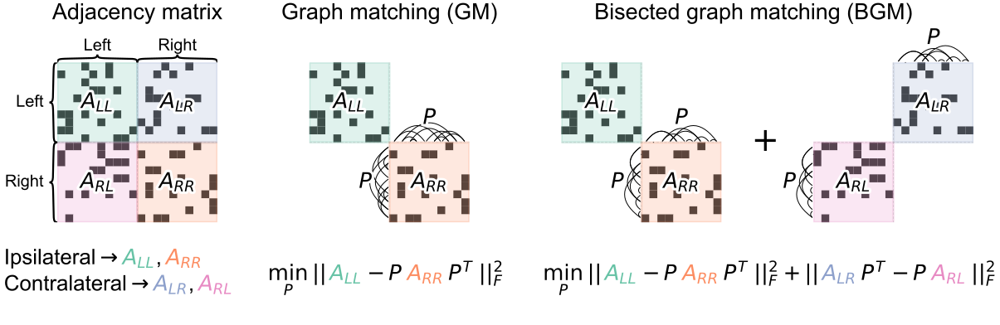

# Further info

## Get in touch
- Email: [bpedigo@jhu.edu](mailto:bpedigo@jhu.edu)
- Twitter: [@bpedigod](https://twitter.com/bpedigod)
- GitHub: [@bdpedigo](https://github.com/bdpedigo)
- Website: [bdpedigo.github.io](https://bdpedigo.github.io/)
- Lab website: [neurodata.io](https://neurodata.io/)
  
## Slides
[Link to my slides](https://docs.neurodata.io/bilateral-connectome/berlin.pdf) from my talk at Berlin Connectomics 2022. 

## graspologic

```{image} images/graspologic_svg.svg
:alt: graspologic logo
:width: 300px
:align: center
```

Our Python package for statistical and machine learning analyses on networks. 

- Fully open-source
- Co-developed with Microsoft Research
- [GitHub](https://github.com/microsoft/graspologic)
- [Documentation](https://microsoft.github.io/graspologic/latest/)
- [Tutorials](https://microsoft.github.io/graspologic/latest/tutorials/index.html)

## Testing for differences between connecomes


Our work on statistical comparisons of connectome networks, in this case to evaluate the bilateral symmetry of a *Drosphila* larva connectome.
- Manuscript forthcoming
- [GitHub repo](https://github.com/neurodata/bilateral-connectome) with all code. Data
  studied here is forthcoming, but tests could already be applied to other data.
- [Jupyter Book](http://docs.neurodata.io/bilateral-connectome/) with explanation for key results/experiments.


## Graph matching

### Bisected graph matching



Finding bilaterally homologous neuron pairs by adapding off-the-shelf graph matching algorithms to allow us to incorporate connections between hemispheres.
- [Manuscript on bioRxiv](https://www.biorxiv.org/content/10.1101/2022.05.19.492713)
- [GitHub repo](https://github.com/neurodata/bgm) with all code and data.
- [Jupyter Book](http://docs.neurodata.io/bgm/) with code to run experiments and reproduce results.

### Graph matching via optimal transport (GOAT)
An improved graph matching procedure which scales better to large networks, and often provides improved matching accuracy over previous approaches (especially when the correlation between the networks is not perfect (i.e. not close to 1)).
- [Manuscript on arxiv](https://arxiv.org/abs/2111.05366)
- [GitHub repo](https://github.com/neurodata/goat)
- [Jupyter Book](http://docs.neurodata.io/goat/outline.html)

## Further reading
### Statistical connectomics
Recent review paper describing many approaches to using statistics and machine learning approaches to analyze connectome datasets.
- [Paper](https://www.annualreviews.org/doi/abs/10.1146/annurev-statistics-042720-023234) 

### Network data science course
Hands-on walkthroughs of a few areas in statistical/machine learning analysis of networks.
- [Jupyter Book](https://bdpedigo.github.io/networks-course/)