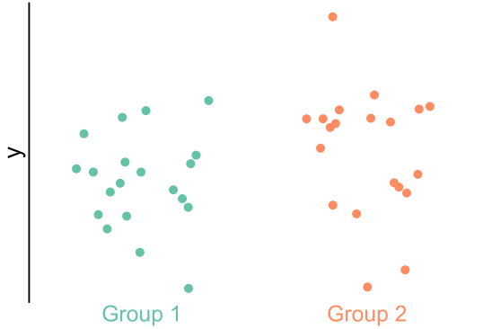

<!-- _paginate: false -->

<!-- # Generative network modeling reveals a first quantitative definition of bilateral symmetry exhibited by a whole insect brain connectome -->
<!--  [_@bpedigod (Twitter)_](https://twitter.com/bpedigod) -->

<!-- # Generative network modeling reveals a quantitative definition of bilateral symmetry exhibited by a whole insect brain connectome -->
# Tools for comparing connectomes:   evaluating the bilateral symmetry of a whole insect brain

 

## Benjamin D. Pedigo
_(he/him) -  [_bpedigo@jhu.edu_](mailto:bpedigo@jhu.edu) 
[NeuroData lab](https://neurodata.io/)_
_Johns Hopkins University - Biomedical Engineering_

#### Team

<!-- Start people panels -->

Michael Winding

Mike Powell

Eric Bridgeford

Ali   Saad-Eldin

Marta Zlatic

Albert Cardona

Carey Priebe

Joshua Vogelstein

<!-- End people panels -->

<!-- 

<!--  -->

<!--  -->

<!-- 
 [_bpedigo@jhu.edu_](mailto:bpedigo@jhu.edu)
 [_@bdpedigo (Github)_](https://github.com/bdpedigo)
 [_@bpedigod (Twitter)_](https://twitter.com/bpedigod)
 [https://bdpedigo.github.io/](https://bdpedigo.github.io/) -->

<!-- <!-- --- -->

<!-- ---
# Motivation
- This is why we need to compare connectomes to understand x,y,z
- Need methods etc. -->

<!-- ---
# What we do (notes)
- clustering
- model estimation
- flow
- testing for differences (e.g. left/right)
- matching (e.g. left/right)
- testing for stereotypy at the edge level (combo of the above two) -->

<!-- --- 
# Approaches for analyzing connectome data

- Model-based clustering of neurons by connectivity 
- Graph matching to estimate correspondence of neurons between datasets/brain hemispheres
- **Statistical testing for connectome comparison**

## Are the  left  and  right  sides of the larva brain connectome 
 
 *different*? -->

--- 
# Comparative connectomics 
- Connectomes $\leftrightarrow$ {disease, evolution, development, experience, ...}
- As related connectomes are mapped, we'll want evaluate the *significance* and *nature* of differences between them
  
# Examples for today's talk

 ## 1.  Are the  left  and  right  sides of a larva brain connectome *different*?

## 2. How can we *automatically* estimate neuron pairing between brain hemispheres?

---
# Testing for differences

### Are these two populations different?

&nbsp; &nbsp; $\color{#66c2a5} Y^{(1)} \sim F^{(1)}$ &nbsp; &nbsp; &nbsp;  $\color{#fc8d62} Y^{(2)} \sim F^{(2)}$
$H_0: \color{#66c2a5} F^{(1)} \color{black} = \color{#fc8d62} F^{(2)}$ vs. $H_A: \color{#66c2a5} F^{(1)} \color{black} \neq \color{#fc8d62} F^{(2)}$

### Are these two *networks* different?

 $A^{(L)} \sim F^{(L)}$ &nbsp; &nbsp; &nbsp; &nbsp;  $A^{(R)} \sim F^{(R)}$ 
$H_0: \color{#66c2a5} F^{(L)} \color{black} = \color{#fc8d62}F^{(R)}$ vs. $H_A: \color{#66c2a5} F^{(L)} \color{black} \neq  \color{#fc8d62} F^{(R)}$

### Many ways to write what "symmetry" means! (different $F$, different statistics)

---
# Example: testing for differences in cell type connections

- Fit block models to both hemispheres
  
- Compare connection probabilities:
  $H_0: \color{#66c2a5} B^{(L)} \color{black} = \color{#fc8d62} B^{(R)}$ 
  $H_A: \color{#66c2a5} B^{(L)} \color{black} \neq  \color{#fc8d62} B^{(R)}$

Overall comparison: $p < 10^{-7}$
<!-- After adjusting for density: $p <0.01$ -->

<!-- ---
# We reject simple notions of symmetry

### Density test
Compares global connection probabilities
(Erdos-Renyi models)

p-value: 
$p < 10^{-23}$

### Cell type connection test
Compares between-cell-type connection probabilities (stochastic block models)

Overall comparison: $p < 10^{-7}$

Density-adjusted: $p <0.01$

 -->

---
# Examining the effect of edge weights

---
# Estimating neuron pairing using graph matching

Morphologies of pairs predicted from connectivity.  ~80-85% agreement with an expert annotator.

<!-- 

- Neuron pair predictions from connectivity using improved graph matching tools

 -->

--- 
# Improving graph matching to suit connectomes

### Incorporating contralateral connections improves matching accuracy

### Improving accuracy and scalability

<!--  -->

Runs in ~1hr for 10k node networks

<!-- _footer: Pedigo et al. bioarxiv (2022), Saad-Eldin et al. arxiv (2021)-->

---
# Conclusions

- Demonstrated novel tools for comparing connectomes, case study on symmetry in a *Drosophila* larva 
  - Model-based network comparison
  - Improved methods for matching neurons via connectivity
- Can be applied more generally to compare connectomes!
- *Ongoing work*: combining testing and matching frameworks to evaluate stereotypy at the edge-level
- **Have other network analysis questions? Let's chat!**

**Slides, code, papers, contact**

 [_bpedigo@jhu.edu_](mailto:bpedigo@jhu.edu)  
[_@bpedigod_](https://twitter.com/bpedigod)
[bdpedigo.github.io](https://bdpedigo.github.io/)

