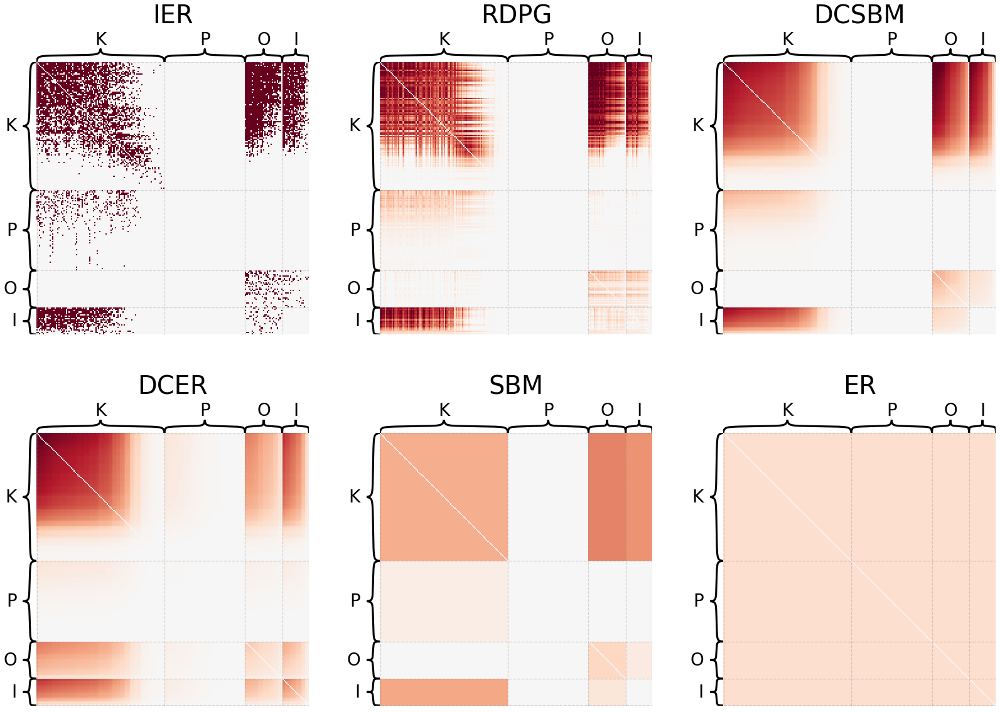

<!-- # Is a whole insect brain connectome bilaterally symmetric?   A case study on comparing two networks -->

<!-- # `graspologic` -->

# `graspologic`: network analysis in Python

<!-- # Towards statistical comparative connectomics:  A case study on the bilateral symmetry of an insect brain connectome -->

<!-- ## Benjamin D. Pedigo1*, Mike Powell1, Eric W. Bridgeford1, Michael Winding2, Carey E. Priebe1, Joshua T. Vogelstein1 -->

<!-- ##### 1 - Johns Hopkins University, 2 - University of Cambridge, $\ast$ - correspondence:  [_bpedigo@jhu.edu_](mailto:bpedigo@jhu.edu)  [_@bdpedigo (Github)_](https://github.com/bdpedigo)  [_@bpedigod (Twitter)_](https://twitter.com/bpedigod)  [_bdpedigo.github.io_](https://bdpedigo.github.io/)  -->

<!-- [github.com/microsoft/graspologic](https://github.com/microsoft/graspologic) -->

## github.com/microsoft/graspologic   
##       

<!--  -->

<!-- ### [neurodata.io](https://neurodata.io/) -->

### Network dimensionality reduction

### Visualization

### Model estimation and sampling

### Clustering

<!--  -->

### Statistical testing

## Are the  left  and  right  sides of this connectome 
 
 *different*?

-  $A^{(L)} \sim F^{(L)}$,  $A^{(R)} \sim F^{(R)}$ 
- $H_0: \color{#66c2a5} F^{(L)} \color{black} = \color{#fc8d62}F^{(R)}$  
  $H_A: \color{#66c2a5} F^{(L)} \color{black} \neq  \color{#fc8d62} F^{(R)}$

<!--  -->

### Graph matching

### Citation

## jmlr.org/papers/volume20/19-490/19-490.pdf

Chung, J.,* Pedigo, B. D.,* Bridgeford, E. W., Varjavand, B. K., Helm, H. S., & Vogelstein, J. T. (2019). GraSPy: Graph Statistics in Python. J. Mach. Learn. Res., 20(158), 1-7.

