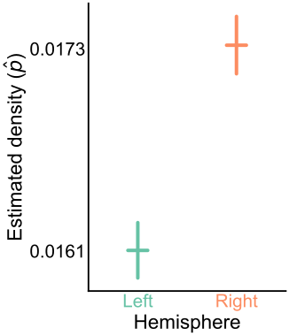

<!-- 
 -->

<!-- 
 -->

# Is a whole insect brain connectome bilaterally symmetric?   A case study on comparing two networks

## Benjamin D. Pedigo1*, Mike Powell1, Eric W. Bridgeford1, Michael Winding2, Carey E. Priebe1, Joshua T. Vogelstein1

 

1 - Johns Hopkins University, 2 - University of Cambridge, $\ast$ - correspondence:  [_bpedigo@jhu.edu_](mailto:bpedigo@jhu.edu)  [_@bdpedigo (Github)_](https://github.com/bdpedigo)  [_@bpedigod (Twitter)_](https://twitter.com/bpedigod)  [https://bdpedigo.github.io/](https://bdpedigo.github.io/) 

### [neurodata.io](https://neurodata.io/)

<!-- # Towards statistical comparative connectomics:  A case study on the bilateral symmetry of an insect brain connectome -->

Aimed to define bilateral symmetry for a pair of networks, and formally test this hypothesis.

Found that left and right hemispheres are different under even the simplest model of a pair of networks

Left and right differ significantly in cell type connection probabilities, even when adjusting for the difference in density

Difference between hemispheres can be explained as combination of a network-wide and cell-type specific effects

Provided a definition of bilateral symmetry exhibited by this connectome, tools for future connectome comparisons

### Motivation

- Connectomes are rich sources of inspiration for architectures in artificial intelligence, but unclear which structural features are necessary for yielding incredible capabilities animal intelligences. 
- Comparing connectomes 
<!-- - We explored statistically principled connectome comparison via a case study of a *Drosophila* larva connectome -->

### Larval *Drosophila* brain connectome

<!-- START subcolumns -->

**Fig 1A:** 3D rendering of larval *Drosophila* brain connectome 

**Fig 1B:** Adjacency matrix sorted by brain hemisphere

- Connectome of a larval *Drosophila* [1] has xxx neurons and xxx synapses

<!-- END subcolumns -->

<!--  -->

## Are  left  and the  right  networks "different"?
- Two sample testing problem! But for networks

### Density testing

**Fig 2A:** Comparison of densities via Fisher's exact test

**Fig 2B:** Densities are significantly different between hemispheres   ($p<10^{-23}$)

### Group connection testing 

<!-- #### A -->

**Fig 3A:** Group connection testing fits SBMs using cell type partition. Group-to-group connection probabilities are compared (Fisher's exact test), p-values are combined (Tippett's method).

<!-- START subcolumns -->

#### B

#### C

<!-- END subcolumns -->

### Density-adjusted group connection testing

<!-- 

 -->

**Figure x:** Adjusted the hypothesis from figure 

### Removing Kenyon cells
<!-- START subcolumns -->

- Density test: super small

- Group connection test: small

- Density adjusted group connection test: not small

<!-- END subcolumns -->

### Edge weight thresholds

<!--  -->

<!-- START columns -->

- some stuff about it blah blah

<!-- END subcolumns -->

### Code

 

[github.com/microsoft/graspologic](https://github.com/microsoft/graspologic)

[github.com/neurodata/bilateral-connectome](https://github.com/neurodata/bilateral-connectome) 

### References

<footer>
[1]: Winding, Pedigo et al. *The complete connectome of an insect brain* In prep. (2022)
</footer>

