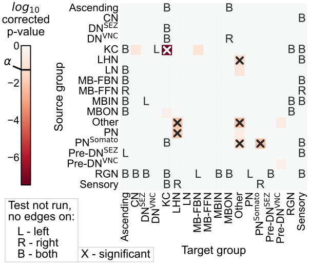

<!-- 
 -->

<!--  
 
 

### Summary -->

<!-- 
 -->

# Is a whole insect brain connectome bilaterally symmetric?   A case study on comparing two networks

## Benjamin D. Pedigo1*, Mike Powell1, Eric W. Bridgeford1, Michael Winding2, Carey E. Priebe1, Joshua T. Vogelstein1

 

1 - Johns Hopkins University, 2 - University of Cambridge, $\ast$ - correspondence:  [_bpedigo@jhu.edu_](mailto:bpedigo@jhu.edu)  [_@bdpedigo (Github)_](https://github.com/bdpedigo)  [_@bpedigod (Twitter)_](https://twitter.com/bpedigod)  [https://bdpedigo.github.io/](https://bdpedigo.github.io/) 

<!-- ### [neurodata.io](https://neurodata.io/) -->

<!-- # Towards statistical comparative connectomics:  A case study on the bilateral symmetry of an insect brain connectome -->

 Summary 

<!-- #### Summary -->

- Aimed to define bilateral symmetry for a pair of networks, and formally test this hypothesis.

- Left and right hemispheres are significantly different under even the simplest model of a pair of networks

- Left and right differ significantly in cell type connection probabilities, even when adjusting for the difference in density

- Difference between hemispheres can be explained as combination of network-wide and cell type-specific effects

- Provided a definition of bilateral symmetry exhibited by this connectome, tools for future connectome comparisons

### Motivation

- Connectomes are rich sources of inspiration for architectures in artificial intelligence.
- Comparing connectomes could help elucidate which structural features are necessary for yielding the capabilities animal intelligences.
- Bilateral symmetry for connectomes has been investigated, but not clearly defined as a network hypothesis.

<!-- - We explored statistically principled connectome comparison via a case study of a *Drosophila* larva connectome -->

### Larval *Drosophila* brain connectome

<!-- START subcolumns -->

**Fig 1A:** 3D rendering of larval *Drosophila* brain connectome [1]. Comprised of ~3k neurons and ~544k synapses.

**Fig 1B:** Adjacency matrix sorted by brain hemisphere. We focus on comparing $\color{#66c2a5} L \rightarrow L$ vs. $\color{#fc8d62} R \rightarrow R$ subgraphs.

<!-- - Connectome of a larval *Drosophila* [1] has xxx neurons and xxx synapses -->

<!-- END subcolumns -->

<!--  -->

## Are the  left  and  right  networks "different"?
 

<!-- - Two sample testing problem! But for networks -->
Requires that we define what we could mean by "different" for a pair of networks, and develop a test procedure for each definition.

### Density test (Model 1)

**Fig 2A:** Testing symmetry under Erdos-Renyi (ER) model [2] amounts to comparing densities (here via Fisher's exact test).

**Fig 2B:** Densities are significantly different between hemispheres   ($p<10^{-23}$).

### Group connection test (Model 2)

<!-- #### A -->

**Fig 3A:** Testing under stochastic block model (SBM) compares probabilities of connections between groups (here using cell types).

<!-- START subcolumns -->

**Fig 3B:** Corrected p-values for each group connection. P-value test of equal group connections is $<10^{-8}$.

<!-- 5 connections are $<0.05$, shown with "X"s. -->

**Fig 3C:** Comparison of probabilities for significant connections: denser hemisphere probability always higher.
<!-- Probability is always higher on right side. -->

### Density-adjusted group connection test (Model 3)

<!-- 

 -->

<!--  -->

 

**Fig 4A:** Density-adjusted hypothesis, modified from Fig 3. 

**Fig 4B:** Corrected p-values for group connections w/ density adjustment. 

<!-- ### Removing Kenyon cells -->

<!-- - Density test: $p < 10^{-26}$
- Group connection test: $p < 10^{-2}$
- Density-adjusted group connection test: $p \approx 0.5$ -->

<!-- ### Removing Kenyon cells
Reran all tests after removing the asymmetric cell type (see below) -->

### Notions of bilateral symmetry

<!--  -->

#### With Kenyon cells
| **Model** |                       $H_0$ (vs. $H_A \neq$)                       | p-value |
| :----: | :----------------------------------------------------------------: | :-----: |
| **1** |  $\color{#66c2a5} p^{(L)} \color{black} = \color{#fc8d62}p^{(R)}$  |    x    |
| **2** | $\color{#66c2a5} B^{(L)} \color{black} = \color{#fc8d62} B^{(R)}$  |         |
| **3** | $\color{#66c2a5}B^{(L)} \color{black}  = c \color{#fc8d62}B^{(R)}$ |         |

#### Without Kenyon cells
| Model |                       $H_0$ (vs. $H_A \neq$)                       | p-value |
| :----: | :----------------------------------------------------------------: | :-----: |
| **1** |  $\color{#66c2a5} p^{(L)} \color{black} = \color{#fc8d62}p^{(R)}$  |    x    |
| **2** | $\color{#66c2a5} B^{(L)} \color{black} = \color{#fc8d62} B^{(R)}$  |    d    |
| **3** | $\color{#66c2a5}B^{(L)} \color{black}  = c \color{#fc8d62}B^{(R)}$ |         |

<!-- #### With Kenyon cells
| Model  |                       $H_0$ (vs. $H_A \neq$)                       | p-value |
| :----- | :----------------------------------------------------------------: | :-----: |
| ER     |  $\color{#66c2a5} p^{(L)} \color{black} = \color{#fc8d62}p^{(R)}$  |    x    |
| SBM    | $\color{#66c2a5} B^{(L)} \color{black} = \color{#fc8d62} B^{(R)}$  |         |
| DA-SBM | $\color{#66c2a5}B^{(L)} \color{black}  = c \color{#fc8d62}B^{(R)}$ |         |

#### Without Kenyon cells
| Model  |                       $H_0$ (vs. $H_A \neq$)                       | p-value |
| :----- | :----------------------------------------------------------------: | :-----: |
| ER     |  $\color{#66c2a5} p^{(L)} \color{black} = \color{#fc8d62}p^{(R)}$  |    x    |
| SBM    | $\color{#66c2a5} B^{(L)} \color{black} = \color{#fc8d62} B^{(R)}$  |    d    |
| DA-SBM | $\color{#66c2a5}B^{(L)} \color{black}  = c \color{#fc8d62}B^{(R)}$ |         | --> |

### Edge weight thresholds

<!--  -->

**Fig 5A:** Removed edges w/ weight (synapse count or proportion of input to downstream neuron) below some threshold, testing bilateral symmetry for each resulting pair of networks. 

**Fig 5B:** Higher edge weight thresholds generally make networks more symmetric. Less apparent when using synapse counts as edge weights (not shown). 

### Limitations and extensions
- Many other models to consider (e.g. random dot product graph [3])
- Many other potential neuron groupings for group connection testing
- Matched nodes between networks

### Code and references
 

 

[github.com/microsoft/graspologic](https://github.com/microsoft/graspologic)

[github.com/neurodata/bilateral-connectome](https://github.com/neurodata/bilateral-connectome) 

<footer>
[1]: Winding, Pedigo et al. *The complete connectome of an insect brain,* In prep. (2022)
 
[2]: Chung et al. *Statistical connectomics,* Ann. Rev. Statistics and its Application (2021)
 
[3]: Athreya et al. *Statistical inference on random dot product graphs: a survey,* JMLR (2017)
</footer>

