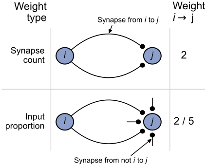
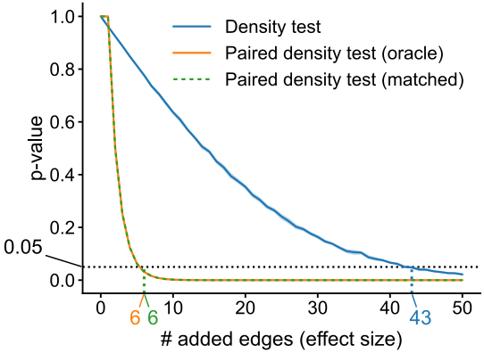

<!-- _paginate: false -->

# The connectome of a larval *Drosophila* brain

 

## Benjamin D. Pedigo
(he/him)
[NeuroData lab](https://neurodata.io/)
Johns Hopkins University - Biomedical Engineering

 [bpedigo@jhu.edu](mailto:bpedigo@jhu.edu)
 [@bdpedigo (Github)](https://github.com/bdpedigo)
 [@bpedigod (Twitter)](https://twitter.com/bpedigod)
 [bdpedigo.github.io](https://bdpedigo.github.io/)

### These slides at: 
<!-- ### [tinyurl.com/princeton-bilarva](https://tinyurl.com/princeton-bilarva) -->

<!-- ---

# Connectomics is useful...

TODO: (5) plot of "connectome prevalence over time"

TODO: (5) highlight one example fly result (? maybe central complex) -->

---

# Many goals of connectomics involve linking connectome to other properties

---

# Comparative connectomics as a potential solution? 

- Map connectomes from related individuals/organisms which may differ in feature $X$: 
  - Genome
  - Behavioral patterns/habits
  - Life experience
  - Developmental stage
- Compare connectomes
- Understand how $X$ {affects, is affected by, is associated with} connectome structure

<!-- --- 
# Connectome $\leftrightarrow$ {development, genetics}

> ... we selectively altered the location or activity of [...] neurons and generated new EM volumes of the manipulated samples **to investigate the effects on connectivity**.

*Emphasis added* -->

---

# Why is comparative connectomics hard?

## Collecting the data is still a large effort...

## But how do we even compare connectomes once we have them?
- ~~Data are networks~~
  - Data are networks with rich attributes
- Data will always have noise
  - "Experimental noise"
  - "Biological noise"
- Data are big (and getting bigger)
 
--- 

# Outline

- ### **Larval connectome dataset**
  - Flow
  - Connectivity based cell types
- ### Connectome comparison via network hypothesis testing
- ### Pairing neurons across connectomes via graph matching
- ### Ongoing extensions/applications

---
<!-- Timing: ~6 min -->

# Larval _Drosophila_ brain connectome 

~3k neurons, ~550K synapses
Both hemispheres

<!-- Include  the numbers of sites, etc.  -->
<!--  -->
<!--  -->

<!-- _footer: Winding, Pedigo et al. bioRxiv (2022) -->

---

# High level (mostly anatomical) cell types

--- 

# Axons/dendrites can be split

---

# This split induces 4 graphs (or layers)

--- 

# What are these different "channels" doing?

---

# Quantifying high-level "feedforward/feedback"

---

# Comparing independently sorted channels

--- 
# Edge reciprocity

--- 

# Outline

- ### **Larval connectome dataset**
  - Flow
  - Connectivity based cell types
- ### Connectome comparison via network hypothesis testing
- ### Pairing neurons across connectomes via graph matching
- ### Ongoing extensions/applications

---
# Spectral embedding
- Spectral decomposition of the adjacency matrix (or Laplacian)
- Spectral decomp. + clustering how to be a consistent estimator of block model

---

# Stochastic block model

- Each node is assigned to a group
- $B$ is a matrix of connection probabilities between groups

---
# Diagram of procedure 
- mention embedding
- cluster - when to stop

---

# Neurons clustered by connectivity using recursive spectral clustering

Where to stop splitting?

<!-- _footer: Winding, Pedigo et al. bioRxiv (2022) -->

---
# Using *pairs* and *models* to evaluate cell type groupings
<!-- TODO: (2) diagram/describe SBM cross validation -->

<!--  -->

- Clustering nodes corresponds with inferring groups in a stochastic block model (DCSBM)...
- How well do these models generalize to the other side of the brain (let alone the next maggot)?

--- 

<!-- ### Cluster morphology  -->

---
# (maybe) describe morphological quantification

---

# Bilateral symmetry

> "This brain is bilaterally symmetric."
<!-- > &nbsp;&nbsp;&nbsp;&nbsp;&nbsp;&nbsp;  -Neuroscientists -->

> "What does that even mean? And how would we know if it wasn't?"
<!-- > &nbsp;&nbsp;&nbsp;&nbsp;&nbsp;&nbsp;  -Us -->

<!--  -->
<!--  -->

## Are the  left  and  right  sides of this connectome 
 
 *different*?

--- 

# Outline

- ### Larval connectome dataset
- ### **Connectome comparison via network hypothesis testing**
- ### Pairing neurons across connectomes via graph matching
- ### Ongoing extensions/applications

---

# Are these populations different?

- Known as two-sample testing
- $\color{#66c2a5} Y^{(1)} \sim F^{(1)}$, $\color{#fc8d62} Y^{(2)} \sim F^{(2)}$
- $H_0: \color{#66c2a5} F^{(1)} \color{black} = \color{#fc8d62} F^{(2)}$  
  $H_A: \color{#66c2a5} F^{(1)} \color{black} \neq \color{#fc8d62} F^{(2)}$

--- 
# Are these _networks_ different?

- Want a two-network-sample test!
-  $A^{(L)} \sim F^{(L)}$,  $A^{(R)} \sim F^{(R)}$ 
- $H_0: \color{#66c2a5} F^{(L)} \color{black} = \color{#fc8d62}F^{(R)}$  
  $H_A: \color{#66c2a5} F^{(L)} \color{black} \neq  \color{#fc8d62} F^{(R)}$

---
# Assumptions
- Know the direction of synapses, so network is *directed*
- For simplicity (for now), consider networks to be *unweighted*
- For simplicity (for now), consider the  left $\rightarrow$ left  and  right $\rightarrow$ right  (*ipsilateral*) connections
- Not going to assume any nodes are matched

---
# Erdos-Renyi model
<!-- Timing: ~10 -->

- All edges are independent
- All edges generated with the same probability, $p$

---
# Detect a difference in density

p-value < $10^{-22}$

---
# Connection probabilities between groups

--- 
# Group connection test

--- 
# Detect differences in group connection probabilities

- 5 group-to-group connections are significantly different (after multiple comparisons correction)
- Overall test (comparing all blocks):  p-value $<10^{-7}$

---
# Should we be surprised?

- Already saw that even the overall densities were different
- For all significant comparisons, probabilities on the right hemisphere were higher
- Maybe the right is just a "scaled up" version of the left?
   - $H_0: \color{#66c2a5}B^{(L)} \color{black}  = c \color{#fc8d62}B^{(R)}$  
  where $c$ is a density-adjusting constant, $\frac{\color{#66c2a5} p^{(L)}}{\color{#fc8d62} p^{(R)}}$

---
# After adjusting for density, differences are in KCs

Overall p-value: $<10^{-2}$

---
# To sum up...

> "This brain is bilaterally symmetric."
<!-- >   &nbsp;&nbsp;&nbsp;&nbsp;&nbsp;&nbsp;  -Neuroscientists -->

Depends on what you mean...

#### With Kenyon cells
|   Model   |                       $H_0$ (vs. $H_A \neq$)                       |    p-value    |
| :-------: | :----------------------------------------------------------------: | :-----------: |
|  **ER**   |  $\color{#66c2a5} p^{(L)} \color{black} = \color{#fc8d62}p^{(R)}$  | ${<}10^{-23}$ |
|  **SBM**  | $\color{#66c2a5} B^{(L)} \color{black} = \color{#fc8d62} B^{(R)}$  | ${<}10^{-7}$  |
| **daSBM** | $\color{#66c2a5}B^{(L)} \color{black}  = c \color{#fc8d62}B^{(R)}$ | ${<}10^{-2}$  |

#### Without Kenyon cells
|   Model   |                       $H_0$ (vs. $H_A \neq$)                       |    p-value     |
| :-------: | :----------------------------------------------------------------: | :------------: |
|  **ER**   |  $\color{#66c2a5} p^{(L)} \color{black} = \color{#fc8d62}p^{(R)}$  | ${<}10^{-26}$  |
|  **SBM**  | $\color{#66c2a5} B^{(L)} \color{black} = \color{#fc8d62} B^{(R)}$  |  ${<}10^{-2}$  |
| **daSBM** | $\color{#66c2a5}B^{(L)} \color{black}  = c \color{#fc8d62}B^{(R)}$ | $\approx 0.51$ |

---
# Examining the effect of edge weights

<!-- ---
# What is an edge weight anyway?

 -->

---

# Highest edge weight networks show no asymmetry

<!-- 

## Synapse count thresholding  -->

<!--  -->

<!-- 

## Input proportion thresholding -->
<!-- 

 -->

--- 

# Outline

- ### Larval connectome dataset
- ### Connectome comparison via network hypothesis testing
- ### **Pairing neurons across connectomes via graph matching**
- ### Ongoing extensions/applications
---

<!-- Timing: 23:00  -->

# Bilaterally homologous neuron pairs 

We believe a matching exists!

<!-- _footer: Eschbach et al. eLife (2021) -->

--- 
# What is graph matching?

---
# How do we measure network overlap?

## $\min_{P \in \mathcal{P}} \underbrace{\|A_1 - \overbrace{PA_2P^T}^{\text{reordered } A_2}\|_F^2}_{\text{distance between adj. mats.}}$

where $\mathcal{P}$ is the set of permutation matrices

<!-- TODO: (3) make a figure diagraming a permutation/matching of nodes -->

- Measures the number of edge disagreements for unweighted networks,
- Norm of edge disagreements for weighted networks

---
# How do we do graph matching?

- Relax the problem to a continuos space
  - Convex hull of permutation matrices
- Minimize a linear approximation of objective function (repeat)
- Project back to the closest permutation matrix

<!-- _footer: Vogelstein et al. PLOS One (2015) -->

---
# Matching (by connectivity only) performs fairly well

With "vanilla" graph matching: ~80% correct (according to expert annotator)

---
# Many ways to try to improve on this...

- Edge types allow for "multilayer" graph matching
- Partial knowledge of the matching (seeds)
- Morphology (e.g. NBLAST)

<!--  -->

# Thus far, we've not used the contralateral connections

## These are about 1/3 of the edges in the brain!

<!-- _footer: Pantazis et al. Applied Network Science (2022), Fishkind et al. Pattern Recognition (2019) -->

---
# From graph matching to bisected graph matching

<!-- _footer: Pedigo et al. bioRxiv (2022) -->

--- 
# Contralateral connections are helpful!

<!-- _footer: Pedigo et al. bioRxiv (2022) -->

---
<!-- Timing: 31:00 -->

# Performance improvement on the full brain

--- 

# Outline

- ### Larval connectome dataset
- ### Connectome comparison via network hypothesis testing
- ### Pairing neurons across connectomes via graph matching
- ### **Ongoing extensions/applications**
  
---
# Pairs facilitate more powerful tests

- Generate an Erdos-Renyi network ($A$)
- Perturb a copy of it ($B$) (add edges)
- Test for differences between $A$ and $B$

<!-- ---
# Testing for "stereotypy" in edge structure

Is matching stronger than expected under some model of independent networks?

_footer: Eichler et al. Nature (2017), Fishkind et al. Applied Network Science (2021) -->

--- 

# Summary 
<!-- 41 min -->

- Model-based network comparison enables testing (and refining) hypotheses about connectomes
  - We proposed a few tests, but just the beginning! 

- Graph matching can pair neurons across datasets
  - Helpful to adapt off-the-shelf algos. to use biological info (e.g contralaterals, edge types)

**Aim to apply these (and other) tools to make inferences from connectome comparisons!**

---

## References

<!-- 

 -->

<!-- ## Larva brain connectome -->

[Winding, M. & Pedigo, B.D. et al. The connectome of an insect brain. bioRxiv 2022.11.28.516756 (2022).](https://www.biorxiv.org/content/10.1101/2022.11.28.516756)

[Pedigo, B. D. et al. Generative network modeling reveals quantitative definitions of bilateral symmetry exhibited by a whole insect brain connectome. bioRxiv 2022.11.28.518219 (2022).](https://www.biorxiv.org/content/10.1101/2022.11.28.518219)

[Pedigo, B. D. et al. Bisected graph matching improves automated pairing of bilaterally homologous neurons from connectomes. Network Neuroscience (2022).](https://direct.mit.edu/netn/article/doi/10.1162/netn_a_00287/113527/Bisected-graph-matching-improves-automated-pairing)

## Code

  

[github.com/microsoft/graspologic](https://github.com/microsoft/graspologic)

[github.com/neurodata/maggot_models](github.com/neurodata/maggot_models)

[github.com/neurodata/bilateral-connectome](github.com/neurodata/bilateral-connectome)

[github.com/neurodata/bgm](github.com/neurodata/bgm)

<!-- 

 -->

<!-- ## Model-based testing

 -->

<!-- ## Improved matching

(Or for WIP final implementation see
[github.com/microsoft/graspologic/pull/960](github.com/microsoft/graspologic/pull/960)) -->

<!-- ## graspologic -->
<!-- 

 -->

--- 

# Acknowledgements

#### Team

Michael Winding

Mike Powell

Eric Bridgeford

Ali   Saad-Eldin

Marta Zlatic

Albert Cardona

Carey Priebe

Joshua Vogelstein

Tracers who contributed to larva connectome, Heather Patsolic, Youngser Park, NeuroData lab, Microsoft Research
Figures from Scidraw + Noun Project (Alexander Bates, Xuan Ma, Gil Costa, Vivek Kumar, Leslie Coonrod)

#### Funding
NSF Graduate Research Fellowship (B.D.P.), NSF CAREER Award (J.T.V.), NSF NeuroNex Award (J.T.V and C.E.P.), NIH BRAIN Initiative (J.T.V.)

---
# Questions?

#### Slides: 
#### [tinyurl.com/princeton-bilarva](https://tinyurl.com/princeton-bilarva)

 
 
 
 

### Benjamin D. Pedigo
 [bpedigo@jhu.edu](mailto:bpedigo@jhu.edu)
 [@bdpedigo (Github)](https://github.com/bdpedigo)
 [@bpedigod (Twitter)](https://twitter.com/bpedigod)
 [bdpedigo.github.io](https://bdpedigo.github.io/)
