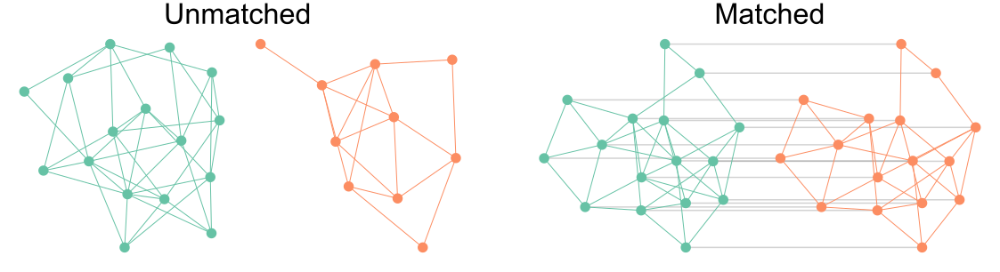
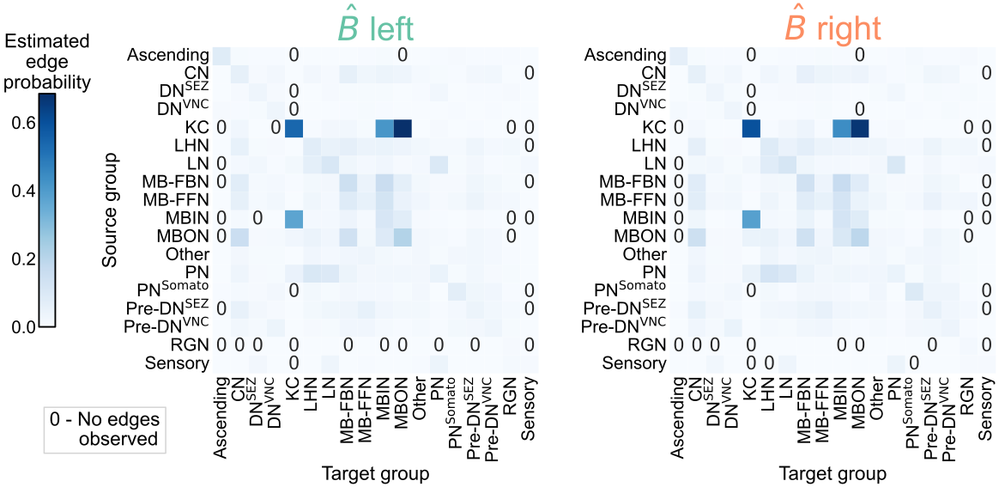
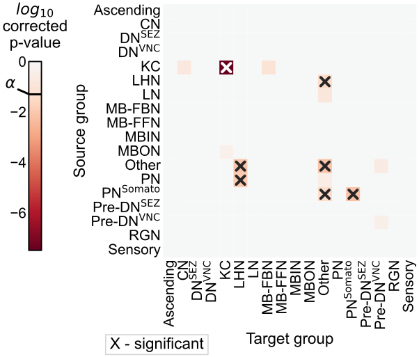
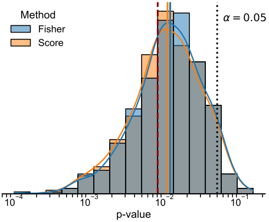
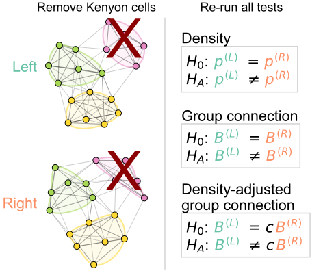

<!-- _paginate: false -->

<!-- # Generative network modeling reveals a first quantitative definition of bilateral symmetry exhibited by a whole insect brain connectome -->
<!--  [_@bpedigod (Twitter)_](https://twitter.com/bpedigod) -->

<!-- # Generative network modeling reveals a quantitative definition of bilateral symmetry exhibited by a whole insect brain connectome -->
# Tools for comparative connectomics:   case studies from two sides of a larval Drosophila brain

 

## Benjamin D. Pedigo
(he/him)
[NeuroData lab](https://neurodata.io/)
Johns Hopkins University - Biomedical Engineering

 [_bpedigo@jhu.edu_](mailto:bpedigo@jhu.edu)
 [_@bdpedigo (Github)_](https://github.com/bdpedigo)
 [_@bpedigod (Twitter)_](https://twitter.com/bpedigod)
 [bdpedigo.github.io](https://bdpedigo.github.io/)

### These slides at: 
### [tinyurl.com/princeton-bilarva](https://tinyurl.com/princeton-bilarva)

---

# Connectomics is useful...

---

# Many of the stated goals of connectomics rely on linking connectome to other domains...

<!-- /Users/bpedigo/JHU_code/pcc/pcc/results/figs/diagram/link_connectome.png -->

<!--  -->

<!--  -->

---

# Connectome $\leftrightarrow$ memory

> ...the acquisition of wiring diagrams across multiple individuals will yield insights into **how experiences shape neural connections.**

*Emphasis added*

<!-- _footer: Mind of a mouse, Abbott et al. 2020 -->

---
# Connectome $\leftrightarrow$ evolution

> Comparative connectomics of [...] **species across the phylogenetic tree** can infer the archetypal neural architecture of each bauplan and identify any circuits that possibly converged onto a shared and potentially optimal, structure.

*Emphasis added*

<!-- _footer: Neural architectures in the light of comparative connectomics, Barsotti + Correia et al. 2021-->

---
# Connectomes across development

<footer>Witvliet et al. Nature (2021)</footer>

---

# But it is methodologically hard to compare connectomes! this is a test

--- 

# Outline for today

- Describe a dataset that I'll use for these examples throughout
- Show how connectome comparison can be framed as network hypothesis testing
- Show how we can use automated tools for predicting the correspondence of neurons
  across datasets
- Mention some extensions to use/combine/extend these tools that we're working on

<!-- ---

# Data -->

---

# _Drosophila_ larva (AKA a maggot) brain connectome 

<!-- See [Michael Windings's talk](https://conference.neuromatch.io/abstract?edition=2021-4&submission_id=recVeh4RZFFRAQnIo) -->
- Collaboration with Marta Zlatic/Albert Cardona's groups - led by Michael Winding
- First whole-brain, single-cell connectome of any insect
- ~3000 neurons, ~550K synapses
- Both hemispheres of the brain reconstructed

<!--  -->

<footer>
Winding, Pedigo et al. “The complete connectome of an insect brain.” In prep. (2022)
</footer>

---

<!--  -->

# Are the  left  and  right  sides of this connectome 
 
 *different*?

---

# Are these populations different?

- Known as two-sample testing
- $\color{#66c2a5} Y^{(1)} \sim F^{(1)}$, $\color{#fc8d62} Y^{(2)} \sim F^{(2)}$
- $H_0: \color{#66c2a5} F^{(1)} \color{black} = \color{#fc8d62} F^{(2)}$  
  $H_A: \color{#66c2a5} F^{(1)} \color{black} \neq \color{#fc8d62} F^{(2)}$

--- 
# Are these two _networks_ different?

- Want a two-network-sample test!
-  $A^{(L)} \sim F^{(L)}$,  $A^{(R)} \sim F^{(R)}$ 
- $H_0: \color{#66c2a5} F^{(L)} \color{black} = \color{#fc8d62}F^{(R)}$  
  $H_A: \color{#66c2a5} F^{(L)} \color{black} \neq  \color{#fc8d62} F^{(R)}$

---
# Assumptions
- We know the direction of synapses, so network is *directed*.
- For simplicity (for now), consider networks to be *unweighted*.
- For simplicity (for now), consider the  left $\rightarrow$ left  and  right $\rightarrow$ right  (*ipsilateral*) connections only.
- Not going to assume any nodes are matched

---
# Erdos-Renyi model

- All edges are indepentent
- All edges generated with the same probability, $p$

---
# Density-based testing

<!-- 

 -->

<!-- - $P[i \rightarrow j] = p$ -->
<!-- - Compare probabilities:
  $H_0: \color{#66c2a5} p^{(L)} \color{black} = \color{#fc8d62}p^{(R)}$  
  $H_A: \color{#66c2a5} p^{(L)} \color{black} \neq  \color{#fc8d62} p^{(R)}$ -->

<!-- 

 -->

<!-- 

 -->

---
# We detect a difference in density

- p-value < $10^{-22}$

--- 
# Stochastic block model

- Edge probabilities are a function of a neuron's group

---
# Connection probabilities between groups

<!-- 

 -->

--- 
# Group-based testing

--- 
# We detect a difference in group-to-group connection probabilities

- After multiple comparison, find 5 group-to-group connections which are significantly different
- Combine (uncorrected) p-values (like a meta-analysis), leads to p-value for overall test of $<10^{-7}$

---
# Should we be surprised?

- Already saw that even the overall densities were different
- For all significant comparisons, probabilities on the right hemisphere were higher
- Maybe the right is just a "scaled up" version of the left?
   - $H_0: \color{#66c2a5}B^{(L)} \color{black}  = c \color{#fc8d62}B^{(R)}$  
  where $c$ is a density-adjusting constant, $\frac{\color{#66c2a5} p^{(L)}}{\color{#fc8d62} p^{(R)}}$

---
# Adjusting for a difference in density

<!-- ---
# Even with density adjustment, we detect a difference

 -->

---
# Remaining differences are isolated to KCs

---
# So the Kenyon cells (KCs) are the only group where we detect remaining differences...

- ER test: $p <10^{-26}$
- SBM test: $p \approx 0.003$
- Adjusted SBM test: $p \approx 0.43$

---
# To sum up...

| Model | $H_0$ (vs. $H_A \neq$)                                             |  KCs  |     p-value     | Interpretation                                           |
| ----- | ------------------------------------------------------------------ | :---: | :-------------: | -------------------------------------------------------- |
| ER    | $\color{#66c2a5} p^{(L)} \color{black} = \color{#fc8d62}p^{(R)}$   |   +   |   $<10^{-23}$   | Reject densities the same                                |
| SBM   | $\color{#66c2a5} B^{(L)} \color{black} = \color{#fc8d62} B^{(R)}$  |   +   |   $< 10^{-7}$   | Reject group connection probabilities the same           |
| aSBM  | $\color{#66c2a5}B^{(L)} \color{black}  = c \color{#fc8d62}B^{(R)}$ |   +   | $\approx 0.002$ | Reject above even after accounting for density           |
| ER    | $\color{#66c2a5} p^{(L)} \color{black} = \color{#fc8d62}p^{(R)}$   |   -   |   $<10^{-26}$   | Reject densities the same (w/o KCs)                      |
| SBM   | $\color{#66c2a5} B^{(L)} \color{black} = \color{#fc8d62} B^{(R)}$  |   -   | $\approx 0.003$ | Reject group connection probabilities the same (w/o KCs) |
| aSBM  | $\color{#66c2a5}B^{(L)} \color{black}  = c \color{#fc8d62}B^{(R)}$ |   -   | $\approx 0.43$  | Don't reject above after density adjustment (w/o KCs)    |

---

# Matching neurons

--- 

# Extensions and ongoing work

---
# matched versions of our tests
- we think greater power, basically

---
# testing for a significant matching
- evaluate stereotypy at a single neuron level, basically

---
# the value of pairs - looking at models
- show the hierarchical clustering
- SBM cross validation curve 

--- 

# Summary 

---

# How to use these tools?
## graspologic
## bilateral repo 
## bgm 
## get in touch! 

--- 
# Acknowledgements

#### Team

<!-- Start people panels -->

Michael Winding

Mike Powell

Eric Bridgeford

Ali   Saad-Eldin

Marta Zlatic

Albert Cardona

Carey Priebe

Joshua Vogelstein

<!-- End people panels -->

#### Funding

---
# Questions?

 
 
 
 
 

### Benjamin D. Pedigo
 [_bpedigo@jhu.edu_](mailto:bpedigo@jhu.edu)
 [_@bdpedigo (Github)_](https://github.com/bdpedigo)
 [_@bpedigod (Twitter)_](https://twitter.com/bpedigod)
 [https://bdpedigo.github.io/](https://bdpedigo.github.io/)
