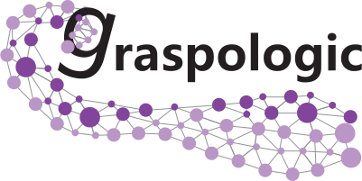

<style scoped> 
p {
    font-size: 24px;
}
</style>

# Maggot brain, mirror image? A statistical analysis of bilateral symmetry in an insect brain connectome

## Benjamin D. Pedigo

_Johns Hopkins University_
_[NeuroData lab](https://neurodata.io/)_
[_@bdpedigo (Github)_](https://github.com/bdpedigo)
[_@bpedigod (Twitter)_](https://twitter.com/bpedigod)
[_bpedigo@jhu.edu_](mailto:bpedigo@jhu.edu)


---

# What is a connectome? (for *this* talk)

A **connectome** is a network model of brain structure consisting of <span style="color: #ed7d31"> nodes which 
represent individual neurons </span> and <span style="color: #4472c4"> edges which represent the presence of a synaptic 
connection </span> between those neurons.

---
# Many connectomics questions require comparison
- Understand wiring substrate of learning/memory
- Understand links between genetics or disease and connectivity
- Understand how different neural architectures lead to different computational abilities

<p></p>
<p></p>
<p></p>

> "Understanding statistical regularities and learning which variations are stochastic and which are secondary to an animal’s life history will help define the substrate upon which individuality rests and require comparisons between circuit maps within and between animals." [1]

<footer>
[1] Abbott, Larry F., et al. "The mind of a mouse." Cell  (2020)
</footer>

--- 

# Larval _Drosophila_ brain connectome


--- 
# Are these populations the same? 
- Known as two-sample testing
- $Y_1 \sim F_1$, $Y_2 \sim F_2$
- $H_0: F_1 = F_2$  vs.  $H_A: F_1 \neq F_2$


<!--  -->

--- 
# How can we compare two _networks_?


--- 
# Briefly, the parameters of the data 

---
<!-- <style scoped>section { justify-content: start; }</style> -->
# The simplest thing: Erdos-Renyi (ER) model

<!-- <div class="twocols">

## ER model
- $A \sim Bernoulli(p)$
- item
- item
- item

<p class="break"></p>


</div> -->

<style scoped>
section {
  padding-right: -100;
}
</style>


--- 


# A slightly more complicated thing one could do: stochastic block model (SBM)
- describe the SBM

---
# An even more flexible model: Random dot product graph (RDPG)

---
# RDPG results 

--- 
# How sensitive are they? 

--- 
<!-- # ```graspologic``` -->



```
pip install graspologic
```

[](https://pepy.tech/project/graspologic)  [](https://github.com/microsoft/graspologic)  [](https://github.com/microsoft/graspologic)  [](https://opensource.org/licenses/MIT)

---
# Acknowledgements